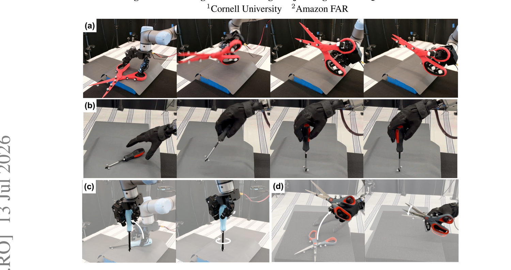
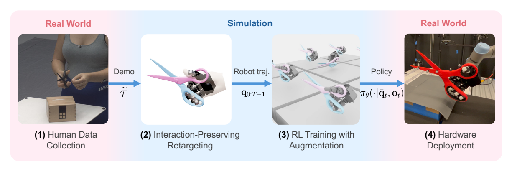
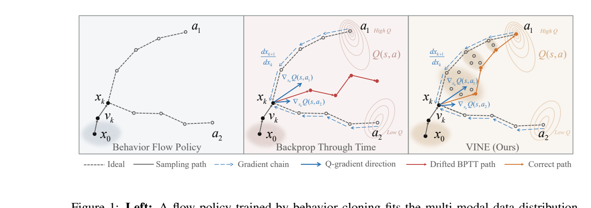
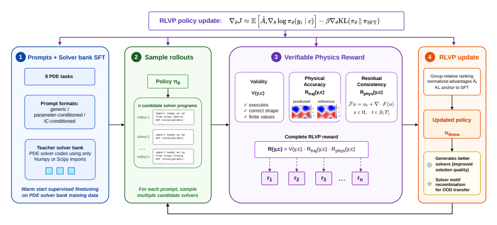
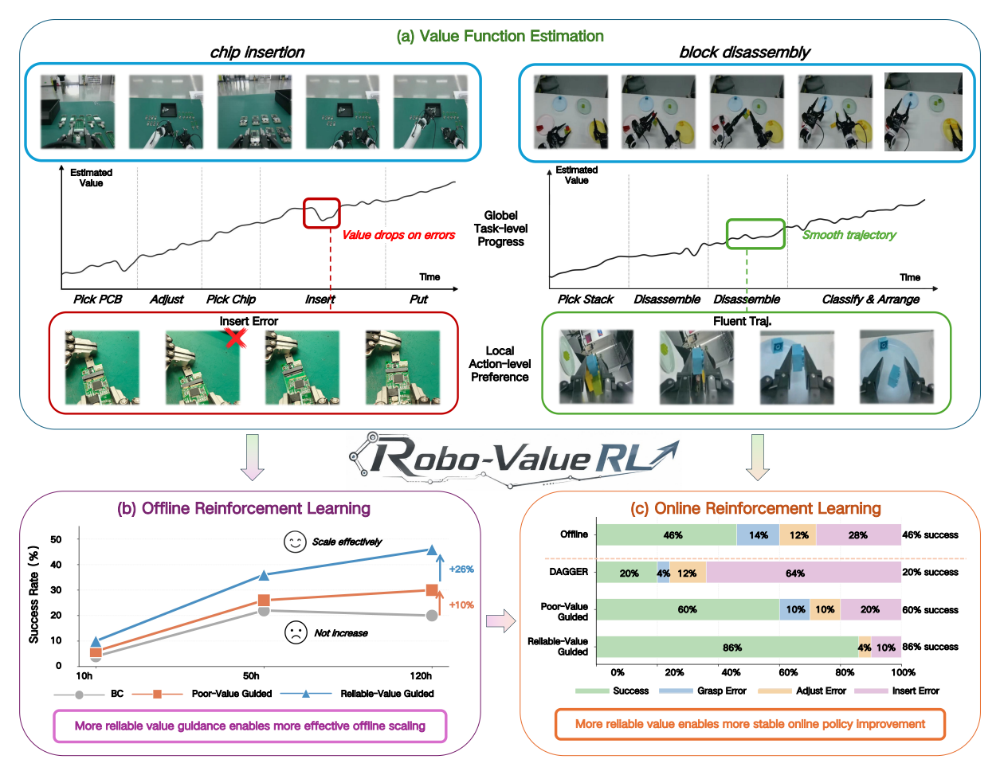
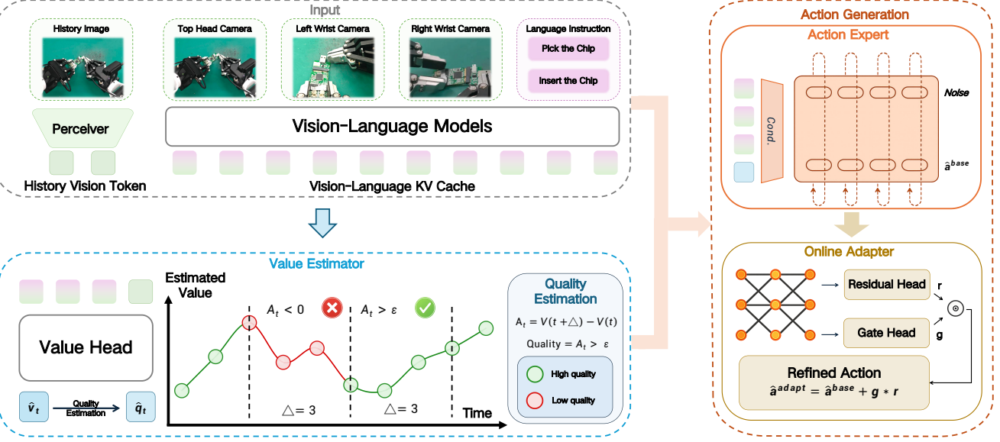
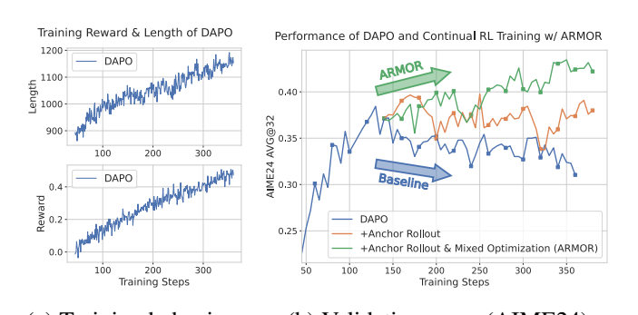
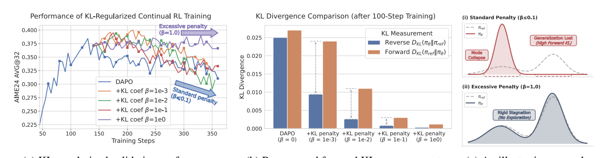

# 强化学习应用领域最新论文简报

- **简报日期**: 2026-07-14
- **检索窗口**: 2026-07-07 → 2026-07-14（近 7 天 arXiv 预印本，含 CoRL/IEEE 在投）
- **筛选口径**: 仅收录顶尖企业（Amazon FAR、Microsoft Research 等）/ 顶级科研院校（MIT、Cornell、清华、北大、人大、USTC、HKUST）/ 可对标顶会（CoRL、NeurIPS、ICLR、ICRA/IROS）的预印本；剔除来源不明初创与「换基准复述旧结论」型论文
- **主题范围**: 强化学习的**落地应用**——灵巧操作 sim-to-real、生成式控制策略、可验证物理奖励、离线到在线机器人学习、大模型 RL 训练稳定性
- **配套图像分析**: 每篇均配「动机图 / 架构图 / 实验结果图」的抽取与解读，图像原文见 `figures/<arxiv_id>/`

---

## 本期速览

| # | 论文 | 机构 | 一句话论断 | arXiv |
|---|------|------|-----------|-------|
| 1 | REGRIND | 康奈尔大学 · Amazon FAR | 灵巧操作的 sim-to-real 不需大数据：从**单条**人类演示出发，用「重定向 + 残差 RL」学出剪刀/螺丝刀等接触密集工具操作，零样本上真机 | 2607.11874 |
| 2 | VINE | AgiBot（智元）· 港科大 · 北大 | 流匹配策略的 RL 不稳定**不是**迭代生成之过，而是采样策略之过；换掉采样即可端到端 value-gradient 反传全部 10 步去噪 | 2607.10369 |
| 3 | RLVP | 麻省理工学院 | 把「可验证奖励」从二值（能跑/通过）升级为**连续物理精度**，用 RL 后训练让 7B 模型写的 PDE 求解器超过更大模型 | 2607.10474 |
| 4 | Robo-ValueRL | 人大 · 北大 · 微软研究院 · X-Humanoid | 离线到在线机器人 RL 的成败**强关联于价值函数可靠性**；把可靠价值贯穿预训练+在线，毫米级插接 86%、拆解 84% | 2607.09866 |
| 5 | ARMOR | 中科大 · 北大 · 达特茅斯 | LLM 的 RL「验证集坍缩」源于过优化；反向 KL 不够，需用参考策略的**离线锚样本**主动稳定 | 2607.10481 |

> **信号判断**: 本批次五篇均为「生产/落地」信号而非实验室复述。两条清晰的实践转向：
> **(A) 机器人侧——用结构先验降 RL 的样本/工程成本**：REGRIND 用单条演示的重定向先验（1）、VINE 修采样让表达力强的生成式策略能被 value-gradient 训练（2）、Robo-ValueRL 用可靠价值筛数据（4）。
> **(B) 大模型侧——把「奖励/稳定性」做细**：RLVP 把奖励从二值细化到连续物理精度（3）、ARMOR 用锚样本对抗过优化坍缩（5）。共同主题是 **「RL 的瓶颈已从算法本身转向奖励信号质量与训练稳定性」**。

---

## 1. REGRIND：面向灵巧操作的极简重定向引导 RL 配方

- **arXiv**: 2607.11874 ｜ **提交**: 2026-07-13 ｜ **机构**: 康奈尔大学（Cornell）、Amazon FAR
- **作者**: Yunhai Feng, Natalie Leung, Jiaxuan Wang, Lujie Yang, Haozhi Qi, Preston Culbertson
- **项目/代码**: https://yunhaifeng.com/REGRIND ｜ **关键词**: 灵巧操作、运动重定向、Sim-to-Real

### 摘要
人形全身控制近来有一个简单配方奏效：把人类动作重定向为机器人运动参考，再用 RL 训练策略去跟踪。但**这套配方能否迁移到灵巧操作**并不显然——操作涉及接触密集的复杂动力学，需要精细调控接触模式与力。REGRIND 提出一个极简的重定向引导 RL 流水线，**从单条人类演示**学习灵巧操作策略：把人-物运动重定向为保持「手-物空间与接触关系」的机器人参考，在仿真中训练**残差 RL 策略**跟踪物体中心关键点，再经细致的系统辨识**零样本迁移到真机**。策略在两种多指手（LEAP、WUJI）上完成剪刀、螺丝刀等接触密集工具操作，动作流畅、类人。

### 方法
- **real-to-sim-to-real 四步流水线**（见架构图）: ① 给定含手/物位姿的人类演示 → ② 用**交互感知重定向**把人手动作转到机器人（保持手-物空间关系）→ ③ 仿真中大规模 RL 跟踪重定向轨迹 → ④ 零样本迁移真机。
- **交互网格（interaction mesh）**: 从人形 loco-manipulation 借来的公式，改造到手-物操作，用「交互保持」的方式维护手与物体关键点的空间结构，而非仅跟踪稀疏姿态。
- **残差 RL + 物体中心关键点**: 以重定向轨迹既做**运动先验**又做**重置分布**；策略学习相对参考的残差，跟踪目标是物体中心关键点（而非关节角），降低对精确关节跟踪的依赖。
- **数据增广**: 灵巧操作数据稀缺，故在训练中**动态扰动初始配置**，扩大任务空间覆盖，使策略对不同初始条件泛化。
- **sim-to-real 四要素**（论文核心贡献）: 成功迁移不仅需要「交互保持的重定向」，还需 **① 观察/动作空间的谨慎设计、② 适当的域随机化与课程、③ 细致的系统辨识**（用响应曲线标定真机关节）。critic 额外可见特权信息以缩小仿真-真机差距。

### 相关工作
- **人形全身控制的重定向+RL 配方**（成功但主要在 loco-motion）——本文首次系统迁移到**接触密集的灵巧操作**并分析其可行边界。
- **注入外部先验降低 RL 探索成本**: 重定向参考轨迹、VLM 粗规划等；本文沿此方向，用忠实转移的人手动作作先验。
- **对比对象**: DexMachina 等灵巧操作基线——在螺丝刀任务上二者都近满分，但 DexMachina 在更难的**剪刀**任务（复杂物体动力学）上性能退化，REGRIND 保持近满分成功率。

### 图像分析

| 动机/任务图（原文 Figure 1） | 架构图（原文 Figure 2） |
|---|---|
|  |  |

- **动机/任务图（`figures/2607.11874_REGRIND/fig1_tasks.png`，原文 Figure 1）**: 四个接触密集「工具使用」任务的真机照片——(a) LEAP-剪刀、(b) WUJI-螺丝刀、(c) LEAP-螺丝刀、(d) WUJI-剪刀。**读图要点**：跨**两种形态迥异的多指手**验证同一配方，且任务都需要「捏合+旋转+力调控」的复合接触，直观支撑「配方通用、不挑硬件」的论断。
- **架构图（`figures/2607.11874_REGRIND/fig2_pipeline.png`，原文 Figure 2）**: 从左到右的 real→sim→real 数据流：人类演示（手+物位姿）→ 交互感知重定向 → 仿真大规模 RL → 零样本真机。**读图要点**：重定向发生在 RL **之前**（离线一次性），RL 只学「跟踪+残差」，这是「极简」的来源——把难点从「奖励工程/探索」转移到「一条好的参考轨迹 + 训练中的动态增广」。

### 实验与结果
- **仿真性能（Table 1）**: REGRIND 在所有任务上**物体关键点跟踪误差低、成功率近满分**；DexMachina 在螺丝刀任务近满分，但剪刀任务退化。
- **真机零样本迁移（Table 2）**: 在三个可迁移任务上**可靠迁移**；论文用受控实验逐一分析观察/动作空间、域随机化+课程、系统辨识各自的贡献（消融式「系统实验」而非仅报点）。
- **系统辨识（Figure 9 响应曲线）**: 通过对齐真机关节的期望位置（绿）与实际位置（红）来标定，是零样本迁移可行的关键前置。

### 结论 & So-what
灵巧操作的 sim-to-real **可以极简**——不必依赖大规模遥操作数据集，一条人类演示 + 交互保持重定向 + 残差 RL 即可。**对实践者的意义**：做接触密集操作（工具使用、装配）时，与其堆演示数据，不如把工程预算投到「交互保持的重定向质量 + 观察/动作空间设计 + 系统辨识」这三处；论文给出的**要素清单可直接当作 sim-to-real 落地检查表**。局限：仅工具使用类任务、object pose 用动捕直接喂入（真机部署需替换为感知）。**属于可复现的落地配方（代码/视频开放）。**

**未来研究方向**: ① 用真机感知（视觉/触觉位姿估计）替换动捕输入，走向无标记部署；② 测试时用上下文自适应缓解仿真-真机残差；③ 从单条演示扩展到少样本多任务，验证配方在双手协作与更长程装配上的可扩展性。

---

## 2. VINE：驯服用于强化学习的生成式控制策略

- **arXiv**: 2607.10369 ｜ **提交**: 2026-07-11 ｜ **机构**: AgiBot（智元机器人）、香港科技大学、北京大学
- **作者**: Rushuai Yang, Zhuo Han, Houlin Li, Hecheng Wang, Zhichao Wu, Rui Zhang, Zhaowei Zhang, Zihong Chen, Xiaohan Yan, Chiming Liu†, Yi Chen, Wei Shan†, Maoqing Yao†
- **项目**: https://agibottech.github.io/vine

### 摘要
流匹配（flow-matching）策略是机器人学习中一种富表达力的策略参数化，通过从噪声迭代生成动作来建模复杂多模态动作分布。但先前工作发现：用 **value-gradient RL** 扩展这类策略常导致训练不稳定，并将其归咎于「迭代生成」，从而牺牲迭代生成、表达力或 value-gradient 之一。VINE 提出相反结论：**不稳定并非来自迭代生成本身，而是来自沿用自行为克隆（BC）的原始采样策略**——它在 value-gradient RL 下变得脆弱。据此，VINE 提出一种面向 RL 的采样方法：**每一步去噪都重建一个新的插值状态**，为 value-gradient 传播构造稳定可微路径，同时兼容原流匹配去噪。结果：即便对全部 10 步去噪端到端反传，VINE 仍能稳定改进策略，并在 OGBench 离线 RL 基准与真机操作任务上一致超越 SOTA。

### 方法
- **问题诊断**: 直接把 critic 梯度沿去噪步反传（value BPTT）会不稳定；VINE 指出根因是「单条流轨迹 + vanilla 采样」在 RL 下病态。
- **VINE 采样**: 不再沿单一流轨迹前进，而是**在每个去噪步重构一个新的插值状态**，形成稳定、可微的路径用于 value-gradient 反传，同时保留流匹配的迭代精修与表达力。
- **端到端 value-gradient**: 允许对全部 10 步去噪做反向传播而不牺牲表达力或迭代生成——这是与「回避端到端优化」的现有方法的关键区别。

### 相关工作
- **流匹配/扩散策略 + RL**: 现有方法为避不稳定，要么放弃迭代生成、要么降表达力、要么放弃 value-gradient；VINE **三者都保留**。
- **评测协议**: 遵循 QAM 评测协议，在 OGBench 上覆盖 antmaze-large/giant、humanoidmaze 等 8 域 40 任务。

### 图像分析

- **动机图（`figures/2607.10369_VINE/fig1_motivation.png`，原文 Figure 1）**: 三联图——**左**：BC 训练的流策略能拟合多模态数据分布（展示表达力优势）；**中**：直接把 critic 梯度沿去噪步反传（value BPTT）导致问题；**右**：VINE 的采样重建插值状态修复该问题。**读图要点**：这张图是全文论点的浓缩——「多模态表达力值得保留（左），但朴素反传会坏（中），VINE 用重建插值路径救回（右）」。它把「不稳定来自采样而非迭代生成」这一反直觉主张可视化。

### 实验与结果
- **OGBench 离线 RL（Table 1）**: 40 任务 / 8 域，遵循 QAM 协议，VINE 在五个任务上**成功率一致且显著更高**，并报告 wall-clock 微调时间与「需重试轨迹的比例」。
- **真机在线 RL（Table 2、Figure 3）**: 人在回路的插接（plug insertion）任务，20 次试验统计成功率、在线微调时间与重试比例；VINE 能从任意初始位姿学会成功插入。
- **消融（Figure 4/5）**: 与 vanilla Euler 采样对比；改变去噪步数 K 验证「保留迭代精修」的价值。

### 结论 & So-what
生成式（流匹配/扩散）策略与 value-gradient RL **可以兼得**，前提是把采样策略换成 RL 友好的版本。**对实践者的意义**：如果你在用扩散/流匹配策略做机器人操作、又想用 RL 在线提升，不必像过去那样牺牲表达力或回避端到端反传——**换采样即可**。这是一个即插即用、可直接改造现有生成式策略训练栈的方法（来自机器人本体厂商 AgiBot，工程可信度高）。

**未来研究方向**: ① 把 VINE 采样推广到更多生成式策略族（一致性模型、扩散 Transformer）与更长去噪链；② 在更大规模真机与多任务上验证在线 RL 的样本效率；③ 与离线预训练/世界模型结合，缩短真机在线微调时间。

---

## 3. RLVP：以可验证物理和连续奖励后训练大模型

- **arXiv**: 2607.10474 ｜ **提交**: 2026-07-11 ｜ **机构**: 麻省理工学院（MIT）
- **作者**: Pengfei Cai*, Utkarsh Utkarsh*, Alan Edelman, Christopher Vincent Rackauckas†, Rafael Gomez-Bombarelli†

### 摘要
偏微分方程（PDE）是科学与工程建模的基础，但构造可靠数值求解器高度依赖专家对离散化、稳定性条件、边界处理的知识。近来有工作把「解 PDE」当作大模型的代码生成任务，但**多停留在推理时**（提示、调试、自精修、test-time scaling），并不更新模型本身。与此并行，可验证奖励的 RL（RLVR）已是代码/数学推理的强后训练范式，但其验证器通常是**二值的**：编译通过或测试通过。这类信号丢弃了科学正确性的**分级结构**——两个都能跑的求解器，其解精度可能相差几个数量级。RLVP（Reinforcement Learning with Verifiable Physics）用**混合验证器**填补这一空白：硬性程序有效性检查确保可执行，**连续物理奖励**（基于函数空间轨迹误差 + PDE 残差）刻画分级正确性。

### 方法
- **混合验证器**: ① 硬约束——程序有效性（能否编译/运行）；② 连续奖励——`R_traj`（基于参考解的函数空间轨迹误差）+ 物理残差奖励（解是否满足控制方程）。
- **训练流程（见架构图）**: 先用 SFT 在「求解器库（solver bank）」上 warm-start 策略，再用 RLVP 做多 PDE 求解器代码生成的 RL 后训练。
- **可验证环境的丰富性**: 因为「两个合法程序可能解误差差几个数量级」，PDE 模拟成为异常丰富的可验证环境——连续奖励能区分「都能跑但精度不同」的解，这是二值验证器做不到的。

### 相关工作
- **PDE 求解的 LLM 代码生成**: 现有多在推理时（prompting/self-refine/test-time scaling），不改模型；本文做**模型级后训练**。
- **RLVR（可验证奖励 RL）**: 代码/数学中广泛使用但验证器二值；本文把验证器**从二值推广到连续物理精度**。
- **生成式 PDE 代理模型**: 扩散/流匹配直接学解；本文相反——**生成数值方法代码**，用参考解误差 + PDE 残差作执行接地的奖励。

### 图像分析

- **架构图（`figures/2607.10474_RLVP/fig1_overview.png`，原文 Figure 1）**: RLVP 用于多 PDE 求解器代码生成的总览——warm-start 策略后，用「硬有效性检查 + 连续物理奖励」的混合验证器做 RL。**读图要点**：图中把「代码生成 → 执行 → 参考解误差/残差 → 连续奖励 → 策略更新」的闭环画清，直观区分了本文与「二值 pass/fail」RLVR 的差别——**奖励是标量分级而非 0/1**，这正是让 RL 能雕琢求解精度的关键。

### 实验与结果
- **连续奖励的价值**: 相比只用硬约束，加入连续物理精度奖励**将 nRMSE 降低 38%**，证明连续信号确有贡献。
- **小模型反超大模型（发现 4）**: 跨 3B/7B/14B，RLVP 后训练的策略**匹配或超过更大的静态提示基线**——即「后训练一个小模型」优于「提示一个大模型」。
- **零样本跨 PDE 迁移（发现 5）**: 在训练中未见的 10 个 held-out PDE（137 个案例：2D advection、Gray-Scott、1D heat、KdV 等）上改进求解器代码生成，**尤其擅长重组/扩展已学数值 motif**（组合泛化的证据）。

### 结论 & So-what
可验证奖励的**粒度**很重要——从二值升级到连续物理精度，能让 RL 真正雕琢「解的准确度」而不仅是「能不能跑」。**对实践者的意义**：在任何存在**分级正确性**的领域（科学计算、数值代码、需要精度评分的工具生成）做 RLVR 时，不要满足于 pass/fail 奖励；设计一个连续、执行接地的奖励能显著提升上限，并让小模型后训练超过大模型提示。**这是 RLVR 奖励设计的可迁移方法论（来自 MIT，含 SciML/Julia 生态背景，工程可信）。**

**未来研究方向**: ① 把「连续可验证奖励」范式迁移到其他有分级正确性的领域（定理证明的部分进度、电路/CAD、可微仿真）；② 研究连续奖励下的奖励黑客与数值稳定性权衡；③ 扩大 held-out PDE 组合泛化的边界，验证「重组数值 motif」能否上升为通用求解器合成能力。

---

## 4. Robo-ValueRL：面向离线到在线机器人 RL 的可靠价值估计

- **arXiv**: 2607.09866 ｜ **提交**: 2026-07-10 ｜ **机构**: 中国人民大学高瓴人工智能学院、北京林业大学、北京大学、微软研究院、X-Humanoid
- **作者**: Wenke Xia, Pei Ren, Wenbo Yu, Yizhuo Zhang, Jifan Li, Yixue Zhang, Yinuo Zhao, Qingyang Gao 等（通讯：Wenke Xia、Di Hu）
- **项目/代码/数据**: https://gewu-lab.github.io/Robo-ValueRL/ ｜ https://github.com/Open-X-Humanoid/Robo-ValueRL ｜ HuggingFace: X-Humanoid/robo-valuerl

### 摘要
离线到在线（offline-to-online）RL 对可泛化机器人操作很有前景，但其「全栈复杂度」使复现与诊断困难。在这类系统中，**价值估计**在为策略改进筛选异构数据时起核心作用；然而一个中心问题一直被忽视：**价值函数的可靠性如何塑造离线到在线 RL 的策略优化**。Robo-ValueRL 提出统一框架，实现可靠价值估计并系统追踪其对预训练与在线改进的下游影响：学习一个**历史条件化的价值估计器**，用「全局进展」与「局部偏好」两类指标评估其可靠性，再把价值估计传播进「质量条件化的一致性策略预训练」与在线 rollout 上的「残差自适应模块」。跨 **240 小时离线演示 + 3000+ 在线轨迹**，实验表明下游性能与价值可靠性**强关联**：可靠价值→更好的动作质量估计→价值引导的离线 RL 比「质量无关的 BC」更能规模化，并通过优先高质量 rollout 稳定在线改进。系统达成**毫米级精密芯片插接 86%、可泛化积木拆解 84%**。

### 方法
- **历史条件化价值估计器**: 以历史为条件估计价值，用两类可靠性指标衡量——**全局进展（global-progress）**与**局部偏好（local-preference）**。
- **质量条件化一致性策略预训练**: 把价值估计当作「动作质量」信号注入 consistency-policy 预训练，使离线学习优先高质量数据（对比质量无关的 BC）。
- **在线残差自适应模块**: 在线 rollout 上做残差自适应，**优先高质量 rollout 数据**以稳定在线改进。
- **统一测试床**: 显式把「价值可靠性 → 下游策略性能」的链路做成可分析、可诊断的系统。

### 相关工作
- **离线到在线 RL**: 强调其全栈复杂度带来的复现/诊断困难；本文补上「价值可靠性」这一被忽视的中心变量。
- **价值引导 vs 行为克隆**: 论证可靠价值引导的离线 RL 比质量无关 BC **更能规模化**。

### 图像分析

| 动机图（原文 Figure 1） | 架构图（原文 Figure 2） |
|---|---|
|  |  |

- **动机图（`figures/2607.09866_RoboValueRL/fig1_motivation.png`，原文 Figure 1）**: 展示 Robo-ValueRL 如何用「可靠价值」改进离线到在线 RL。**读图要点**：把「价值可靠性」放在因果链的上游——可靠价值决定了数据如何被优先级排序，从而决定策略改进的成败，这为「为什么要专门研究价值可靠性」提供直觉。
- **架构图（`figures/2607.09866_RoboValueRL/fig2_architecture.png`，原文 Figure 2）**: 离线到在线的完整流水线——历史条件化价值估计 → 质量条件化一致性策略预训练 → 在线残差自适应。**读图要点**：价值估计器是贯穿离线与在线两阶段的「中枢」，图清楚地把「价值→数据优先级→策略」的传播路径画出，说明这是一个**诊断导向**的统一框架，而非单点算法改进。

### 实验与结果
- **规模**: 240 小时离线演示 + 3000+ 在线 rollout 轨迹，是较大规模的真机 offline-to-online 研究。
- **主结果**: **毫米级精密芯片插接 86%、可泛化积木拆解 84%**。
- **核心结论（受控分析）**: 下游性能与价值可靠性**强关联**；可靠价值→更好动作质量估计→价值引导离线 RL 优于质量无关 BC，并稳定在线改进。

### 结论 & So-what
在离线到在线机器人 RL 中，**价值函数的可靠性是被低估的胜负手**。**对实践者的意义**：搭建真机 offline-to-online 流水线时，与其只盯策略算法，不如先诊断并提升价值估计的可靠性（用全局进展/局部偏好指标），再用它来筛选异构数据的优先级——这直接决定了能否稳定地从「离线大数据 + 少量在线」中获益。**代码/数据/模型全开（含 X-Humanoid 真机），可复现性强。**

**未来研究方向**: ① 把「价值可靠性诊断」标准化为 offline-to-online 的通用评估协议；② 研究价值可靠性与数据分布/任务难度的定量关系，指导数据采集；③ 扩展到多机器人/跨形态迁移，验证可靠价值引导在异构本体上的通用性。

---

## 5. ARMOR：用离线锚样本稳定 On-Policy 的 LLM 强化学习

- **arXiv**: 2607.10481 ｜ **提交**: 2026-07-11 ｜ **机构**: 中国科学技术大学（USTC）、北京大学、达特茅斯学院
- **作者**: Kexin Huang, Junkang Wu, Jinda Lu, Shuo Yang, Chiyu Ma, Jiancan Wu, Xiang Wang, Xiangnan He 等

### 摘要
RL 已显著增强大模型的推理能力，但训练过程**出了名地脆弱**。本文研究这种不稳定的一个关键来源——**过优化（over-optimization）**：模型以牺牲可泛化推理为代价去利用训练启发式。反向 KL 正则是对抗此类退化的标准手段，但本文分析发现它在此情形下**常常不够**，因为它无法确保对参考分布的**全面覆盖**。为此提出 ARMOR（Anchor Rollout and Mixed Optimization for RL），把范式从「被动惩罚」转向「主动样本稳定」：**(1) Anchor Rollout**——利用来自参考策略的离线数据保留已建立的解题模式；**(2) Mixed Optimization**——重构策略目标以实现「受控探索」而无需辅助损失。跨多种基座（Qwen2.5-Math-7B、Qwen3-8B-Base）的实验证明 ARMOR 有效缓解**验证集坍缩**，在更长训练周期内持续提升。

### 方法
- **问题诊断**: 过优化 → 模型坍缩到少数「捷径」解，丢弃可泛化推理路径，表现为验证集性能坍塌。分析指出**反向 KL 的 mode-seeking 特性**导致覆盖不足（高 Forward KL）；极端加大 β 只能靠牺牲学习来「延迟」坍缩。
- **Anchor Rollout（锚 rollout）**: 引入来自参考策略的**离线锚样本**，主动保留已建立的解题模式，扩大对参考分布的覆盖——对抗 mode collapse。
- **Mixed Optimization（混合优化）**: 重构策略目标，把 on-policy 探索与 off-policy 锚样本混合，实现受控探索而**不依赖辅助损失**（更简洁、更少超参）。

### 相关工作
- **推理型大模型的 RL**: OpenAI o1、DeepSeek R1、Qwen3 等；训练脆弱、易坍缩是共性痛点。
- **反向 KL 正则**: 标准防线，但本文实证其**在过优化情形下覆盖不足**——这是 ARMOR 的立论出发点。

### 图像分析

| 动机图（原文 Figure 1） | 结果图（原文 Figure 2） |
|---|---|
|  |  |

- **动机图（`figures/2607.10481_ARMOR/fig1_motivation.png`，原文 Figure 1）**: 图示过优化问题——DAPO 等基线的奖励持续上升（约 900→1100），但这是「利用捷径」的表象。**读图要点**：训练奖励上升与验证性能背离，直观呈现「过优化」——奖励曲线好看不等于泛化好，这为「需要主动稳定而非只看奖励」立论。
- **结果图（`figures/2607.10481_ARMOR/fig2_results.png`，原文 Figure 2）**: (a) 不同 KL 正则强度下的性能趋势；(b) AIME24 验证分数随训练的变化。**读图要点**：温和的反向 KL（β=1e-1）只能**延迟**坍缩，极端 β=1.0 靠牺牲学习换稳定；而 ARMOR 在**不牺牲学习**的前提下避免验证坍缩——两张子图共同证明「反向 KL 不够、需锚样本」的核心主张。

### 实验与结果
- **设置**: 聚焦「过优化涌现」的持续训练阶段；先用标准 GRPO/DAPO 类方法训练 Qwen2.5-Math-7B 至出现过优化，再对比 ARMOR。
- **主指标**: AIME24 上的 avg@k（k 次平均准确率）；ARMOR **缓解验证集坍缩**，在延长训练周期内**持续提升**，而基线在同期坍塌。
- **KL 消融（Figure 2a）**: 反向 KL 各强度要么延迟坍缩、要么以停止学习为代价换稳定，均不理想。
- **泛化**: 跨 Qwen2.5-Math-7B、Qwen3-8B-Base 多基座验证一致有效。

### 结论 & So-what
LLM 的 RL 稳定性问题**不能只靠反向 KL 惩罚**——需要用参考策略的锚样本主动维持分布覆盖。**对实践者的意义**：在做 RLVR/推理 RL 时，如果观察到「训练奖励还在涨但验证集开始掉」（典型过优化坍缩），加大 KL 系数往往只是延迟问题；ARMOR 提示的方向是**混入参考策略的离线锚样本 + 重构目标做受控探索**，在不牺牲学习速度的前提下延长有效训练窗口。属于**可直接接入现有 GRPO/DAPO 训练栈的稳定化组件**。

**未来研究方向**: ① 锚样本的动态选择/加权（随训练阶段自适应），而非静态参考；② 把「覆盖率」做成可监控的在线指标，用于自动早停或调度；③ 在更大模型与 agentic/多轮 RL 上验证锚样本对抗过优化的普适性。

---

## 该关注谁（本窗口增量）

> 依据：机构影响力、开源资产（代码/模型/数据/真机）带来的社区扩散速度、成果对现有实践的可改造性。

- **Yunhai Feng（康奈尔）+ Amazon FAR 团队**——REGRIND 用「单条演示 + 重定向 + 残差 RL」把灵巧操作 sim-to-real 做成可复现配方，且给出可当检查表的「四要素」，接触密集操作方向关注度增量高。
- **AgiBot（智元）机器人学习团队（Maoqing Yao 等）+ 港科大**——VINE 从本体厂商视角解决「生成式策略 + value-gradient RL」的稳定性，工程可信、即插即用，易被扩散/流匹配策略栈吸收。
- **MIT SciML 组（Christopher Rackauckas、Rafael Gomez-Bombarelli、Alan Edelman）**——RLVP 把「连续可验证奖励」这一方法论从科学计算带回 RLVR 主线，`nRMSE 降 38%`、小模型反超大模型的结论具方法论普适性，预计引发奖励设计讨论。
- **人大高瓴 + 微软研究院 + X-Humanoid（Wenke Xia、Di Hu 等）**——Robo-ValueRL 把「价值可靠性」立为离线到在线机器人 RL 的中心变量，全栈开源 + 真机数据，诊断导向框架易被复用。
- **USTC + 北大（Xiang Wang、Xiangnan He 等）**——ARMOR 精准刻画「验证集坍缩=过优化」并给出锚样本解法，对做推理 RL 的团队有直接工程价值，易引发「反向 KL 是否够用」的方法论讨论。

## 方法论备注
- 检索源：arXiv API（`cs.LG / cs.RO / cs.AI / cs.MA` 等）2026-07-07 → 07-14 提交批次，**按主题聚类而非来源聚类**。
- 严格性：已剔除纯理论无落地、来源不明初创、及「换基准复述旧结论」型条目；保留的五篇均含**新机制 + 可验证实验 + 落地信号**（开源全套或明确工程准则）。
- 图像分析：每篇的动机/架构/结果图由本地脚本从 PDF 按图注定位裁剪（见 `figures/<arxiv_id>/`），解读结合图注原文与正文引用，力求「看图即懂论点」。
- 本简报为文献二次综述，关键数字均取自各论文摘要/正文/表格；如需引用请以 PDF 原文为准（原文见 `papers/`）。
