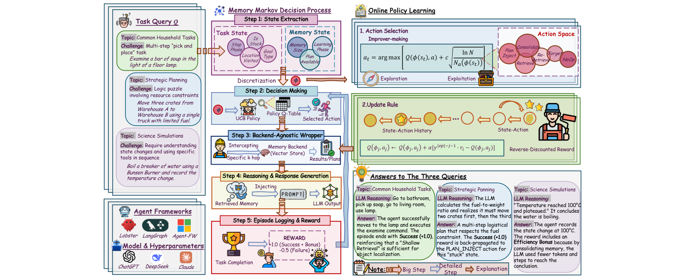
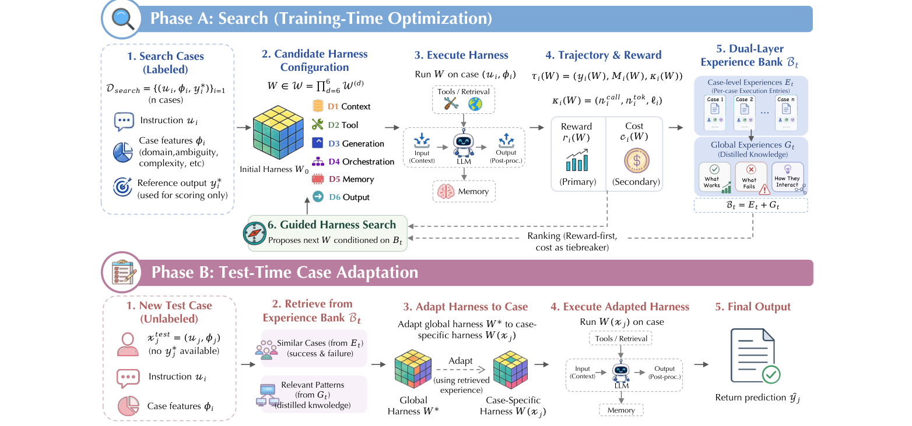
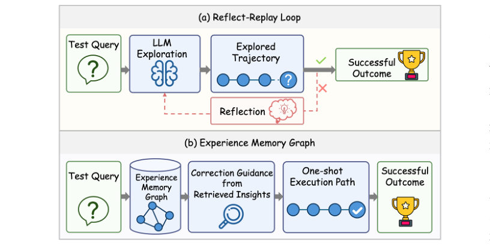
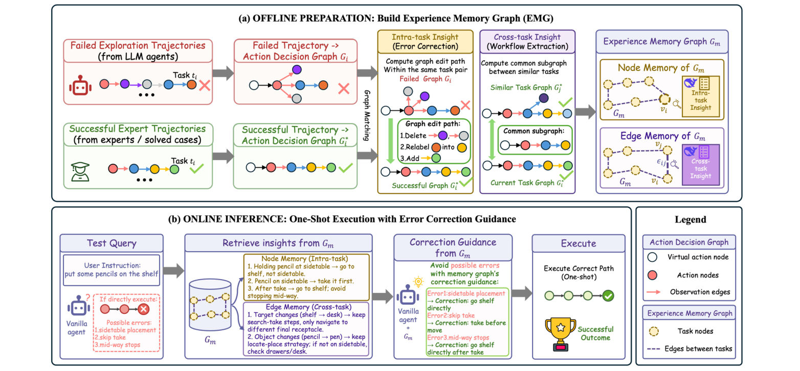
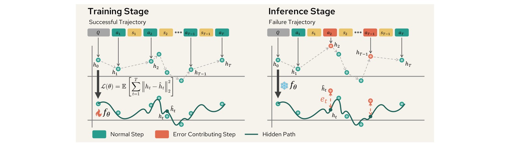
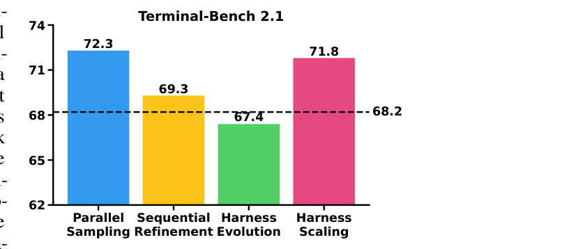
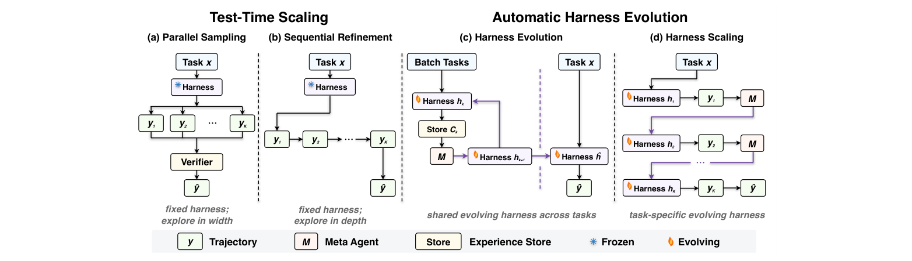

# 智能体（Agent）领域最新论文简报

- **简报日期**: 2026-07-20
- **检索窗口**: 2026-07-13 → 2026-07-20（近 7 天 arXiv 预印本，含 ICLR/NeurIPS/CIKM 在投）
- **筛选口径**: 仅收录顶尖企业（Microsoft Research、Allen Institute for AI 等）/ 顶级科研院校（UCLA、UW-Madison、UW、Notre Dame、SJTU、UESTC 等）/ 可对标顶会（ICLR、NeurIPS、CIKM、COLM）的预印本；剔除来源不明初创与低信噪比复述型论文
- **主题范围**: LLM/VLM 智能体（Agent）——**经验驱动的自适应记忆 / 自演化 agent 框架（harness）/ 失败归因与错误纠正 / 评测方法论的严谨性**
- **配套图像分析**: 每篇均配「动机图 / 架构图 / 实验结果图」的抽取与解读，图像原文见 `figures/<arxiv_id>/`

---

## 本期速览

| # | 论文 | 机构 | 一句话论断 | arXiv |
|---|------|------|-----------|-------|
| 1 | MEMCON | UCLA · UW · Northwestern | 智能体记忆不该用固定启发式：把「何时/取多少/是否注入计划/是否遗忘」建成 MDP，用轻量 UCB bandit 在线学，**零额外 LLM 调用**、几十任务收敛，任务成功 +最高 15.2 分且省 5–20% token | 2607.13591 |
| 2 | MemoHarness | Notre Dame · LMU · USC | 别只优化 prompt——把整个 agent harness 拆成**六个可编辑维度**，用双层经验库按 case 自适应装配，无需测试期标注/反馈/搜索 | 2607.14159 |
| 3 | Experience Memory Graph | 电子科技大学（UESTC） | 把失败纠正从「在线反思」搬到**离线图编辑**：训练期把失败/成功轨迹转成动作决策图，匹配出「图编辑路径」当纠错指令，测试期**一次到位、无试错循环** | 2607.13884 |
| 4 | OAT | UW-Madison · Microsoft Research | 失败归因可以**只用成功轨迹学**：把成功动态用 neural CDE 建成单类模型，失败步=偏离该动态的异常，仅 100 条成功轨迹、比提示 GPT-5 快 200–5000× 且 F1 更高 | 2607.12747 |
| 5 | Rethinking Harness Evolution | Allen Institute for AI · UW | 冷水一盆：自动 harness 进化在**匹配预算 + held-out** 的公平协议下，并不稳定优于简单 test-time scaling，且泛化有限 | 2607.12227 |

> **信号判断**: 本批次五篇收敛于一条主线——**「智能体的增益正从『改模型/加脚手架』转向『从执行经验中自适应地学习控制』，同时评测正在被要求更严谨」**。三条清晰转向：
> **(A) 记忆/harness 从静态启发式 → 学习式自适应**：MEMCON 把记忆操作学成 MDP 策略（1）、MemoHarness 把 harness 六维按 case 自适应装配（2）——都强调「最优行为依赖上下文，不能写死」。
> **(B) 失败纠正从「在线试错反思」→「离线可复用结构」**：EMG 用图编辑路径做一次到位纠错（3）、OAT 用成功轨迹的单类动态模型做零 token 失败归因（4）——都在削掉昂贵的在线 LLM 循环。
> **(C) 方法论的自我警醒**：Rethinking Harness Evolution 用公平协议证伪「自动 harness 进化必然更好」（5），呼应 Agentic RL 侧对「过程奖励是否必须引入新模型」的追问。这批多数**开源**，属可落地信号而非实验室复述。

---

## 1. MEMCON：把智能体记忆建成受控过程（学习式自适应记忆管理）

- **arXiv**: 2607.13591 ｜ **提交**: 2026-07-15 ｜ **机构**: 加州大学洛杉矶分校（UCLA）、华盛顿大学（UW）、西北大学（Northwestern）
- **作者**: Eric Hanchen Jiang, Zhi Zhang, Yuchen Wu, Levina Li, Dong Liu, Xiao Liang, Rui Sun, Yubei Li, Edward Sun, Haozheng Luo, Zhaolu Kang, Aylin Caliskan, Kai-Wei Chang, Ying Nian Wu
- **项目/代码**: github.com/ericjiang18/MemCon

### 摘要
LLM 智能体越来越依赖外部记忆跨任务积累经验，但几乎所有现有方法——从图结构记忆到反思式洞见库——都用**固定、手工设计的启发式**访问记忆。作者主张这种静态记忆观是 agentic learning 的核心瓶颈，因为最优记忆行为**本质上依赖上下文**：任务早期记忆稀疏、宜少检索；重复目标类型宜复用计划而非泛化最近邻查找；卡住时宜换查询重检索；长任务流中记忆库本身须整理与剪枝。MEMCON（Memory as a Controlled Process）把记忆操作建成**马尔可夫决策过程（MDP）**，在线学习一个策略自适应决定「何时/取什么/取多少检索、何时注入蒸馏计划、何时整理或遗忘」。MEMCON **后端无关**：包裹任何现有记忆实现，从逐任务的二值反馈学习，无需预训练、无需额外 LLM 调用，用轻量**表格式上下文 bandit + UCB 探索**，几十个任务内收敛。跨 6 基准、3 agent 框架、3 backbone，较无记忆基线一致提升 5–30+ 分并同时降 5–20% token。

### 方法
- **记忆 MDP**: 状态 `s=(s_task, s_mem)` 融合任务进展（目标类型、步阶段、is_stuck、持有物、已访位置）与记忆状态（库大小、计划可用性、学习阶段）；动作空间 `{RETRIEVE（不同深度）、PLANINJECT、RE-RETRIEVE、CONSOLIDATE、FORGET、NOOP}`。
- **在线学习 + UCB**: 用轻量**表格式上下文 bandit + UCB 探索**在部署时在线学习；每回合后用**反向折扣信用分配**（`γ^(|ep|-j-1)·r`）更新每个访问过的 `(φ_j, a_j)`。
- **零额外成本**: 策略从人类可读先验 warm-start，用二值任务成功反馈更新，**不加任何额外 LLM 调用**，并持久化到磁盘跨任务累积。
- **后端无关包裹器**: 把「记忆控制策略」与「记忆存储后端」解耦——任何现有/未来记忆系统都能继承这套自适应控制。
- **效率奖励**: 奖励含 Efficiency Bonus——若通过整理记忆用更少 token/步达成，则额外加分（图中 boiling water 例）。

### 相关工作
- **记忆管理策略**: 现有多为向量检索（MetaGPT、MemoryBank）、技能库（Voyager）、轨迹摘要（ChatDev）、生成式重排、洞见学习等，均用固定启发式；亦有用深度 RL/LLM 驱动控制器者——MEMCON 走**更轻量**路线（表格 bandit，无预训练/无额外 LLM）。

### 图像分析

| 架构图（原文 Figure 1） | 结果图（原文 Figure 3） |
|---|---|
|  |  |

- **架构图（`figures/2607.13591_MEMCON/fig1_overview.png`，原文 Figure 1）**: 五步闭环——状态抽取 φ → UCB 策略选动作 → 后端无关包裹器拦截「特定 k 跳」检索/计划注入 → 推理与响应生成 → 回合日志与奖励（+1.0 成功+bonus / -0.5 失败）驱动在线策略学习。**读图要点**：图中「Backend-Agnostic Wrapper」把记忆控制从存储后端里剥出来，是「任何记忆系统都能继承自适应控制」的关键；而右侧 UCB 的「探索 vs 利用」更新式说明这是**在部署中在线学**，不是离线训练好再固定。
- **结果图（`figures/2607.13591_MEMCON/fig3_tradeoff.png`，原文 Figure 3）**: token 成本 vs 任务成功的联合权衡——每个面板对应一个（框架, 基准）组合。**读图要点**：MEMCON 落在「更高成功 + 更低 token」的更优区域，直观反驳「记忆越多越好」——自适应地少检索/及时遗忘，反而同时提升成功率与效率。

### 实验与结果
- **规模**: 6 基准（含 ALFWorld、PDDL、ScienceWorld、TriviaQA、WebWalkerQA、GAIA）、3 框架（Lobster、LangGraph、Microsoft Agent-Framework）、3 backbone（GPT-4.1-mini、Claude Sonnet-4、DeepSeek-V3.2）、9 记忆基线。
- **主结果**: 较无记忆基线一致 **+5–30+ 分**成功率，同时**降 5–20% token**；在 ALFWorld/GPT-4.1-mini（Lobster）取所评 10 种记忆中最高分；较基线最高 **+15.2 分**。
- **收敛性**: 表格 bandit 在**几十个任务**内收敛，符合「在线、轻量」定位。

### 结论 & So-what
智能体记忆的最优行为依赖上下文，**不该用固定启发式，而该在线学成一个策略**——且可做到零额外 LLM 调用、后端无关。**对实践者的意义**: 已有向量库/图记忆/技能库时，不必推倒重来——用一个轻量 bandit 包裹器学「何时检索、取多少、何时注入计划、何时遗忘」，就能同时提升成功率与省 token。属于**可直接叠加到现有 agent 记忆栈的自适应控制层**（代码开源）。

**未来研究方向**: ① 状态特征的自动学习（当前手工设计 φ）；② 从二值反馈扩展到稠密/过程反馈；③ 与长期记忆整理策略（何时压缩/归档）联合优化。

---

## 2. MemoHarness：从执行经验中学习的自适应 Agent Harness

- **arXiv**: 2607.14159 ｜ **提交**: 2026-07-14 ｜ **机构**: 圣母大学（University of Notre Dame）、慕尼黑大学（LMU Munich）、南加州大学（USC）
- **作者**: Yue Huang, Wenjie Wang, Han Bao, Yuchen Ma, Xiaonan Luo, Yi Nian, Haomin Zhuang, Zheyuan Liu, Yue Zhao, Xiangliang Zhang
- **项目/代码**: github.com/HowieHwong/MemoHarness

### 摘要
Agent harness 是把 base LLM 变成可执行智能体的外部控制层，管理上下文、工具、编排、记忆、解码与输出处理。harness 设计强烈影响 agent 行为，但多数自动改进方法只优化更窄的工件（prompt、pipeline、workflow），且部署时对所有 case 复用**单一全局 harness**。MemoHarness 是一个**自适应 harness 优化框架**，从自身执行中学习：把 harness 拆成**六个可编辑控制维度**，把逐 case 诊断与蒸馏的全局模式存入**双层经验库**，并用检索到的经验对每个测试 case 自适应装配 harness——**无需测试期标注、反馈或额外搜索**。在 shell-agent、代码生成、分析推理基准上，MemoHarness 超越所比较的固定 harness，并对未见 suite 与 base 模型有选择性迁移；当检索经验可缓存时，其额外上下文成本也具竞争力。

### 方法
- **六维 harness 空间**: D1 上下文装配（构建输入：结构化 prompt/加示例/压缩上下文）、D2 工具交互（何时/如何调工具与检索、top-k、重排）、D3 生成控制、以及其余覆盖编排/记忆/输出处理的维度——把「harness」显式参数化为可编辑维度组合。
- **双层经验库**: 存**逐 case 诊断**（per-case）与**蒸馏的全局模式**（distilled global patterns）两层；训练期通过引导搜索（Phase A）积累经验。
- **测试期自适应装配**: 对每个测试 case 用检索到的经验自适应调整 harness——**不需要测试期标签/反馈/额外搜索**，与「部署单一全局 harness」形成对比。
- **成本控制**: 额外上下文在经验可缓存时保持成本竞争力。

### 相关工作
- **自动改进 agent**: 多聚焦 prompt/pipeline/workflow 等窄工件；MemoHarness 把优化对象升级为**完整 harness 的六维**，并按 case 自适应而非全局固定。

### 图像分析

- **总览图（`figures/2607.14159_MemoHarness/fig1_overview.png`，原文 Figure 1）**: 两段式——Phase A（训练期优化）跑引导搜索积累经验并蒸馏出全局模式，存入双层经验库；部署期对每个 case 用检索经验自适应装配六维 harness。**读图要点**：图中「训练期搜索 → 经验库 → 测试期检索装配」把「learn from its own executions」画清——关键差异是**测试期不再搜索/不需标签**，只做检索式装配，因此比「每个 case 现搜」成本可控，又比「全局单一 harness」更自适应。

### 实验与结果
- **基准**: shell-agent、代码生成、分析推理三类；报告 pass@1 等，示例 0.722→ 提升（见图注）。
- **主结果**: 一致超越所比较的固定 harness；对**未见 suite 与 base 模型**有选择性迁移。
- **成本**: 当检索经验大量可缓存时，额外上下文成本具竞争力（作者对更强统计鲁棒性与组件归因留待未来工作，措辞审慎）。

### 结论 & So-what
harness 是部署时「唯一可动的杠杆」，而**执行经验是构建比单一静态配置更自适应 harness 的实用基质**。**对实践者的意义**: 与其只调 prompt 或对所有请求用同一套 pipeline，不如把 harness 拆成可编辑维度、按 case 用历史经验装配；工程上要注意把可缓存经验做成缓存以控成本。属于**可落地的 harness 自适应范式**（代码开源，作者对普适性claim保持克制）。

**未来研究方向**: ① 组件级归因（哪一维贡献最大）与统计鲁棒性；② 跨领域经验迁移的边界；③ 与在线 RL 结合，把「装配策略」也学出来。

---

## 3. Experience Memory Graph：面向智能体的一次性错误纠正

- **arXiv**: 2607.13884 ｜ **提交**: 2026-07-15 ｜ **机构**: 电子科技大学（UESTC，含长三角研究院·衢州 与 深圳高等研究院）
- **作者**: Wenjun Wang, Yuchen Fang, Fengrui Liu, Zibo Liang, Kai Zheng（通讯）
- **关键词**: 长程智能体、失败恢复、图匹配、离线经验、一次性纠错

### 摘要
LLM 智能体在自主决策上能力显著，但在复杂长程任务中常**误差累积**、难从失败恢复。现有自纠机制依赖**基于 prompt 的反思**，本质脆弱、因迭代试错循环带来高时间与 API 成本，且产生任务专属、难泛化的记忆。为此提出 Experience Memory Graph（EMG），把智能体失败恢复**重构为图匹配问题**：训练期把失败探索轨迹与成功专家轨迹都转成**有向动作决策图**，通过图匹配抽取公共子图（成功工作流）与**图编辑路径**（明确指示如何纠错——在给定观察下增/删/改哪些动作），存入带**任务内节点 + 跨任务边**的记忆图；测试期检索相关洞见并**一次性指导执行，无需试错循环**。

### 方法
- **离线图构建**: 把成对训练轨迹（同一任务的失败 + 成功）各转成有向动作决策图，计算把失败图变换为成功图的**图编辑路径（graph edit path）**，蒸馏成洞见存入记忆图。
- **记忆图结构**: 节点存**局部任务知识**（单任务的成功工作流或纠错路径），边捕获**跨相似任务的泛化动作模式**（任务内节点 + 跨任务边）。
- **测试期一次到位**: 检索相关洞见直接指导执行，**one-shot、无循环**——把「在线 LLM 反思」替换为「离线确定性图计算」，规避小模型难跳出重复错误循环、及长轨迹中根因深埋的问题。

### 相关工作
- **经验记忆构建**: 早期只从成功轨迹抽工作流；后续开始利用失败轨迹（隔离决定性错误动作、失败信用分配等）。EMG 的差异是把纠错显式表达为**图编辑路径**，且离线确定性、测试期免试错。

### 图像分析

| 动机图（原文 Figure 1） | 架构图（原文 Figure 2） |
|---|---|
|  |  |

- **动机图（`figures/2607.13884_ExperienceMemoryGraph/fig1_motivation.png`，原文 Figure 1）**: 对比 (a) 基于反思的迭代纠错（多轮试错循环）与 (b) EMG 的一次性纠错（离线图编辑 → 检索 → 一步到位）。**读图要点**：图直观点出反思式纠错的痛点——迭代循环的时间/API 成本高，且小模型易困在重复错误里；EMG 把纠错知识预先算成图编辑路径，测试期无需再让模型「试错-反思-再试」。
- **架构图（`figures/2607.13884_ExperienceMemoryGraph/fig2_architecture.png`，原文 Figure 2）**: 离线构建阶段——收集失败/成功探索轨迹，转为动作决策图，通过图匹配得公共子图与编辑路径，蒸馏成洞见存入带任务内节点/跨任务边的记忆图。**读图要点**：图把「失败→成功」的转换显式表示为可检索的结构化编辑指令，这是「一次到位」的来源——纠错不再靠在线推理临时生成，而是查一条预计算的图编辑路径。

### 实验与结果
- **数据集（Table 1）**: ALFWorld（3321 训练 / 140 seen / 134 unseen）与 ScienceWorld（1483 / 194 / 211），覆盖具身家务与科学推理，考察空间/程序记忆。
- **主结果**: EMG 在成功率与平均奖励上一致超越 SOTA 反思基线，且**测试期无需试错**——把在线试错成本降为离线一次性图计算。

### 结论 & So-what
长程智能体的失败恢复可以**从「在线反思循环」搬到「离线图编辑路径」**，实现一次到位纠错。**对实践者的意义**: 若你的 agent 常因误差累积失败、且反思循环推高了延迟与 API 成本（尤其小模型），可考虑离线把「失败→成功」的轨迹对编译成图编辑路径库，测试期检索一步纠正——省去试错循环。属于**面向成本/延迟的失败恢复范式**（学术团队，UESTC）。

**未来研究方向**: ① 图编辑路径对开放/非结构化动作空间的适用性；② 跨任务边的泛化边界；③ 与在线 RL/记忆策略（如 MEMCON）结合，动态维护记忆图。

---

## 4. OAT：只用成功轨迹学习的无监督智能体失败归因

- **arXiv**: 2607.12747 ｜ **提交**: 2026-07-14 ｜ **机构**: 威斯康星大学麦迪逊分校（UW-Madison）、微软研究院（Microsoft Research）
- **作者**: Samuel Yeh, Yiwen Zhu, Shaleen Deep, Sharon Li
- **关键词**: 失败归因、单类学习、neural CDE、异常检测、实时诊断

### 摘要
LLM 智能体系统的**失败归因**（identify 哪一步导致任务失败）对调试与改进至关重要。现有方法要么依赖**基于 prompt 的流水线**（计算昂贵），要么需在带 step-level 错误标注的失败轨迹上后训练（标注昂贵、难扩展）。作者主张实用的失败归因模型应**轻量、且无需失败数据的 step-level 监督**训练。为此提出**无监督失败归因**：仅在成功轨迹上训练、推理时对给定失败轨迹识别错误步。OAT 把该问题建为**单类学习（one-class learning）+ neural 控制微分方程（neural CDE）**，在隐空间建模成功轨迹的动态模式；推理时对失败轨迹每一步按其偏离「成功动态」的程度赋异常分，形成错误步集合。仅用 **100 条成功轨迹**训练（3 层 MLP 参数化），OAT 比提示型基线**快 200–5000×**，且在域内/分布外一致超越（F1 分别 +20% / +7%）。

### 方法
- **无监督设定**: 只用成功轨迹训练，**无失败数据、无 step 标注**；推理时给失败轨迹逐步打异常分。
- **单类 + neural CDE**: 用 neural 控制微分方程在隐空间学「成功轨迹的动态模式」，把归因建成单类异常检测——偏离该动态越大的步越可能是错误步。
- **极致轻量**: 3 层 MLP 参数化，推理**零 token 成本**，200–5000× 快于提示 GPT-5，使**实时**失败归因首次可行。

### 相关工作
- **失败归因**: 提示流水线（贵）与 step 标注后训练（贵、难扩展）；OAT 走「只用成功轨迹的单类学习」路线。
- **基准**: 在 MCP-Atlas（域内）与 Who&When 等评测；对比 Random-Step、First-Step、GPT-4o、GPT-5。

### 图像分析

- **总览图（`figures/2607.12747_OAT/fig1_overview.png`，原文 Figure 1）**: OAT 学习成功轨迹的隐藏路径并重构其动态；推理时对失败轨迹按偏离程度赋异常分（图中示例正确定位到 step 7 的幻觉）。**读图要点**：图直观呈现「单类学习」思想——不去建模「错误长什么样」（那需要失败标注），而是建模「正确的动态长什么样」，凡显著偏离者即判为错误步；这解释了为何**只用成功轨迹、零 step 标注**也能做归因。

### 实验与结果
- **域内（Table 1，MCP-Atlas）**: OAT (Top-k) F1 **0.420±0.008**、Recall 0.706、AUROC 显著高于 GPT-5（F1 0.181）、GPT-4o（0.212）、Random/First-Step——**尽管只用 100 条成功轨迹、无失败数据、无 step 标注**。
- **效率**: 推理零 token 成本，**200–5000× 快于**提示型方法。
- **泛化**: 域内 +20% F1、分布外 +7% F1，一致超越提示前沿 LLM（含 GPT-5）。

### 结论 & So-what
失败归因**不必标注失败、不必提示大模型**——只需用成功轨迹学一个「正确动态」的单类模型，把失败步当异常检出。**对实践者的意义**: 想给生产 agent 加实时失败归因/可观测性时，与其每次提示 GPT-5（贵且慢），不如用少量成功轨迹训一个轻量 neural CDE 单类模型，零 token、毫秒级定位错误步。属于**可实时部署的诊断组件**（UW-Madison + MSR，工程可信、代码/数据开放）。

**未来研究方向**: ① 把归因结果回灌训练（与 TRACE/LOTAPO 的信用分配打通）；② 多智能体系统里的分布式失败归因；③ 在线自适应更新「成功动态」以应对分布漂移。

---

## 5. Rethinking Harness Evolution：对自动 Harness 进化评测的严谨性追问

- **arXiv**: 2607.12227 ｜ **提交**: 2026-07-14 ｜ **机构**: Allen Institute for AI（AI2）、华盛顿大学（UW）
- **作者**: Yike Wang, Huaisheng Zhu, Zhengyu Hu, Yige Yuan, Zhengyu Chen, Shakti Senthil, Hannaneh Hajishirzi, Yulia Tsvetkov, Pradeep Dasigi, Teng Xiao
- **关键词**: harness 进化、评测方法论、test-time scaling、泛化、公平协议

### 摘要
本文重审 LLM 智能体的**自动 harness 进化**评测。现有方法用单元测试搜索 harness 配置、再在**同一公开基准**上报告最终性能——这一协议有两处根本隐患：**其一**，harness 进化本身就是反复用任务反馈评估/修订候选的**迭代搜索过程**，如同 agentic test-time scaling，理应在**匹配反馈与推理预算**下与简单的任务级搜索基线比较，以判断增益来自更好的 harness 设计还是仅来自额外搜索；**其二**，搜索与最终评测共享同一基准，报告增益有**过拟合**该任务集的风险。为此，作者在可比预算下把 harness 进化与简单 test-time scaling / discovery 基线对比，并在 **held-out** 任务上评估泛化。在 Terminal-Bench 2.1（GPT-5.4、Claude Opus 4.6）上的实验表明：自动 harness 进化**并不稳定优于**简单 test-time scaling，且**泛化有限**。

### 方法
- **两处方法论隐患**: ① 未在匹配预算下与 test-time scaling 比较（增益可能只来自「多搜了」）；② 搜索与评测同基准→过拟合任务集。
- **公平协议**: 在**可比反馈与推理预算**下对比 harness 进化 vs 简单 test-time scaling / discovery 基线；并在 **held-out** 任务上测泛化。
- **实验对象**: Terminal-Bench 2.1，GPT-5.4 与 Claude Opus 4.6；报告 pass@1，含「无单元测试可用」情形。

### 相关工作
- **harness 进化 / 反思式 prompt 进化**（如 GEPA 等）：本文不提新方法，而是**质疑其评测协议**，呼吁与 test-time scaling 在匹配预算下公平对比、并做 held-out 泛化检验。

### 图像分析

| 动机图（原文 Figure 1） | 方法对比图（原文 Figure 2） |
|---|---|
|  |  |

- **动机图（`figures/2607.12227_HarnessEvolEval/fig1_motivation.png`，原文 Figure 1）**: 在「无单元测试可用」时，各法的平均 pass@1——自动 harness 进化**未展现相对 test-time scaling 的稳定优势**。**读图要点**：这张图是全文立论的靶心——一旦拿掉「用单元测试反复搜索」的便利、并在匹配预算下比较，harness 进化的表面增益就大幅收敛，提示此前的强结果可能来自「搜索预算不对等」。
- **方法对比图（`figures/2607.12227_HarnessEvolEval/fig2_methods.png`，原文 Figure 2）**: 并列展示四类 test-time scaling 与自动 harness 进化算法（生成多候选、分配预算、harness 级类比等）。**读图要点**：图把「harness 进化本质上是一种 test-time 搜索」可视化——因此公平比较必须匹配反馈/推理预算，否则就是在比「谁搜得多」。

### 实验与结果
- **主结果（Table 1，Terminal-Bench 2.1）**: 在无单元测试设定下，自动 harness 进化**未能**比 test-time scaling 提供更强增益，其有效性受质疑。
- **泛化**: 在 held-out 任务上，进化出的 harness 泛化有限——印证「搜索/评测同基准→过拟合」的担忧。
- **结论**: 当前对自动 harness 进化的证据应**谨慎解读**，亟需更公平的评测协议。

### 结论 & So-what
「更多脚手架/自动进化 = 更好」在**公平协议**下并不成立——增益可能只是「搜索预算更多」的假象，且易过拟合评测集。**对实践者的意义**: 在采纳任何「自动 harness/prompt 进化」方案前，务必 ① 在**匹配反馈与推理预算**下与简单 test-time scaling 做对照；② 在 **held-out** 任务上验证泛化。否则可能为「搜索预算」买单却误以为是「设计」增益。属于**评测方法论层面的必要警醒**（AI2 + UW，权威且直指行业惯例）。

**未来研究方向**: ① 标准化「匹配预算 + held-out」的 harness 进化评测协议；② 区分「设计增益」与「搜索增益」的度量；③ 研究何种任务/预算区间下 harness 进化才真正带来设计层面的可迁移增益。

---

## 该关注谁（本窗口增量）

> 依据：机构影响力、开源资产（代码/模型/数据）带来的社区扩散速度、成果对现有实践的可改造性。

- **Eric Hanchen Jiang / Kai-Wei Chang / Ying Nian Wu（UCLA）等 MEMCON 团队**——把「智能体记忆」从固定启发式升级为在线学习的 MDP 策略，且零额外 LLM 调用、后端无关、代码开源，易被现有记忆栈吸收，记忆方向关注度增量高。
- **Sharon Li（UW-Madison）+ Microsoft Research（本窗口双响：OAT + TRACE）**——OAT 用「只学成功轨迹」的单类模型做零 token 失败归因，与其 Agentic RL 侧的 TRACE 形成「诊断 + 信用分配」的组合拳，工程可信、实时可用。
- **Yue Huang / Xiangliang Zhang（Notre Dame）等 MemoHarness 团队**——把 harness 拆成六维、按 case 自适应装配，且对claim保持克制（明确把统计鲁棒性留待未来），是少见「自适应又审慎」的 harness 工作。
- **AI2 + UW（Hannaneh Hajishirzi、Yulia Tsvetkov、Pradeep Dasigi 等）**——Rethinking Harness Evolution 用公平协议给「自动 harness 进化」泼冷水，方法论权威，预计引发对 test-time scaling vs harness 进化的重新对齐讨论。
- **Kai Zheng（UESTC）等 EMG 团队**——把失败纠正从在线反思搬到离线图编辑路径，实现一次到位纠错，对成本/延迟敏感的长程 agent 落地有直接价值。

## 方法论备注
- 检索源：arXiv API（`cs.AI / cs.CL / cs.LG / cs.MA` 等）2026-07-13 → 07-20 提交批次，**按主题/论断聚类而非来源聚类**。
- 严格性：已剔除来源不明初创与「换基准复述旧结论」型条目；保留的五篇均含**新机制 + 可验证实验 + 落地信号**（多数开源；第 5 篇为方法论批判性工作，价值在于纠偏评测惯例）。
- 图像分析：每篇的动机/架构/结果图由本地脚本从 PDF 按图注（caption）定位、并合并图注上方的图像/矢量绘图边界框裁剪至 `figures/<arxiv_id>_<短名>/`，解读结合图注原文与正文引用，力求「看图即懂论点」。
- 本简报为文献二次综述，关键数字均取自各论文摘要/正文/表格；如需引用请以 PDF 原文为准（原文见 `papers/`）。
