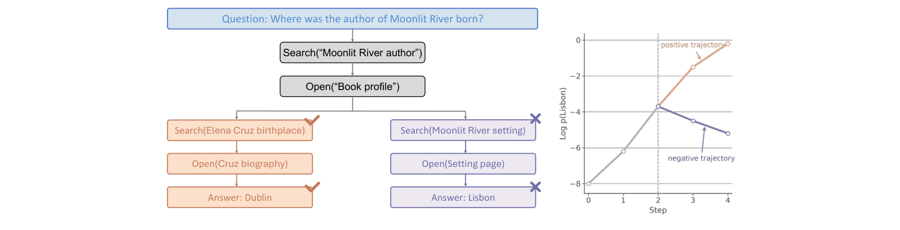
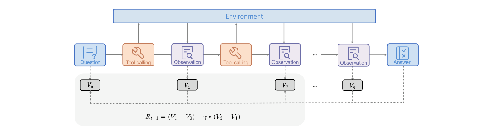
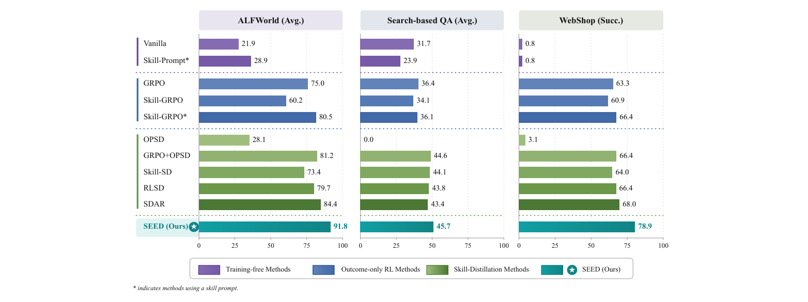
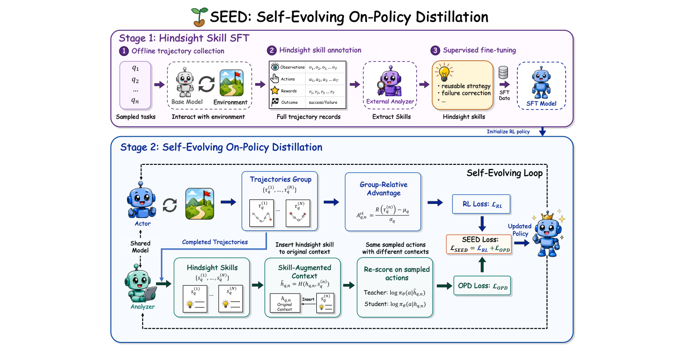
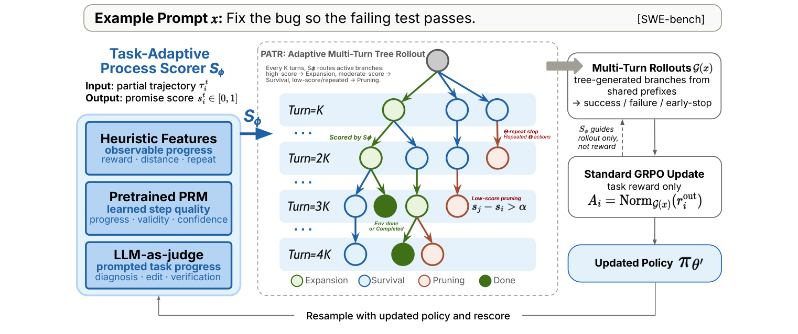
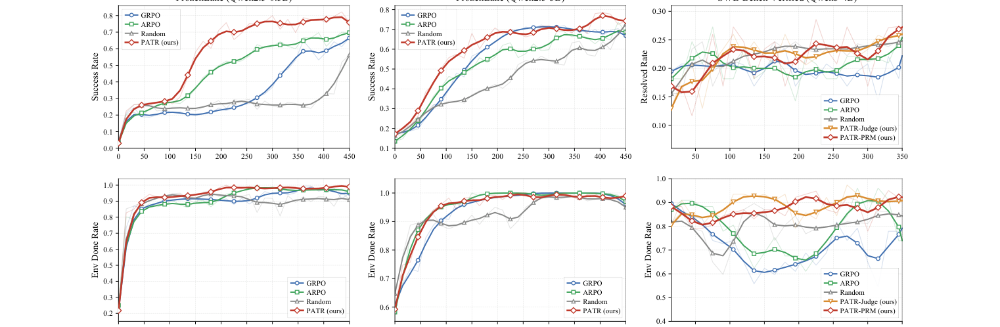
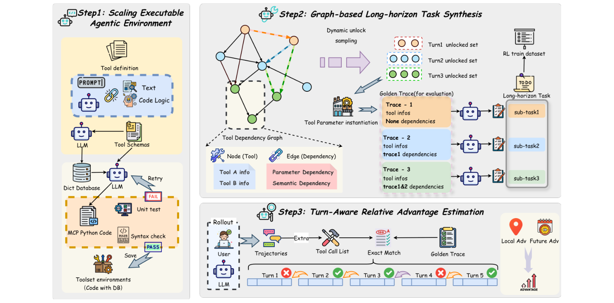
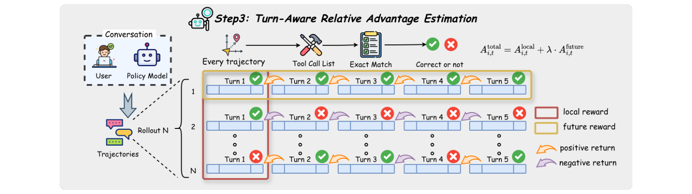

# Agentic RL（智能体强化学习）领域最新论文简报

- **简报日期**: 2026-07-20
- **检索窗口**: 2026-07-13 → 2026-07-20（近 7 天 arXiv 预印本，含 ICLR/NeurIPS 在投）
- **筛选口径**: 仅收录顶尖企业（Microsoft Research、Amazon、Meituan LongCat 等）/ 顶级科研院校（清华、UCSD、UW-Madison、MBZUAI、CUHK、浙大、人大、CAS）/ 可对标顶会（ICLR、NeurIPS、ICML、ACL）的预印本；剔除来源不明初创与「换基准复述旧结论」型论文
- **主题范围**: **Agentic RL**——用强化学习后训练 LLM/VLM 智能体，聚焦长程多轮任务的**信用分配（credit assignment）**、可扩展训练环境、以及自演化式监督
- **配套图像分析**: 每篇均配「动机图 / 架构图 / 实验结果图」的抽取与解读，图像原文见 `figures/<arxiv_id>/`

---

## 本期速览

| # | 论文 | 机构 | 一句话论断 | arXiv |
|---|------|------|-----------|-------|
| 1 | TRACE | UW-Madison · Microsoft Research | 长程智能体 RL 的瓶颈是信用分配：用**冻结参考模型的 gold-answer 对数似然**在工具调用边界做 TD 打分，无需 critic/PRM/judge，BrowseComp-Plus 上 4B 从 7.2→35.6 | 2607.13988 |
| 2 | SEED | 清华 · 浙大 · CUHK · NTU | 把已完成轨迹**回溯成自然语言技能**再蒸馏回策略：分析器与执行器共享同一模型、随 RL 共同演化，ALFWorld 91.8 / WebShop 78.9 | 2607.14777 |
| 3 | PATR | UCSD · Amazon | 多轮 RL 的 rollout 拓扑该变了：用**过程打分器引导的自适应树 rollout**，把预算投向有希望的中间状态，SWE-Bench +5.0、FrozenLake +9.3 | 2607.15610 |
| 4 | LOTAPO | 浙江大学 | 用策略自身做**留一轮归因（leave-one-turn）**：把某轮替换为 `[DELETE]` 看 gold 答案似然变化，得到自生成过程奖励，7 个 QA 集平均 EM 0.326（超 IGPO +0.053） | 2607.13501 |
| 5 | ToolVerse | Meituan LongCat · 北大 · 复旦 | Agentic RL 受限于环境规模：从 **422 个真实 MCP 环境（4438 工具）**自动合成长程任务（GUST 数据集），配 Turn-Aware 相对优势，ACEBench-Agent +15.15 | 2607.15660 |

> **信号判断**: 本批次五篇高度收敛于同一论断——**「Agentic RL 的瓶颈已从算法/奖励本身，转移到长程轨迹的信用分配与训练环境的规模」**。围绕这条主线有三条清晰的技术转向：
> **(A) 用「免额外模型」的方式造出稠密过程奖励**：TRACE 用冻结参考模型的答案似然 TD（1）、LOTAPO 用策略自身的留一轮归因（4）——都刻意不引入 PRM/judge/teacher，避免奖励漂移与成本。
> **(B) 把「结构」注入 rollout 与监督**：PATR 改 rollout 拓扑（树而非 N 条独立轨迹，3）、SEED 把完成轨迹回溯成可复用技能再蒸馏（2）、ToolVerse 用工具依赖图合成长程任务并做 turn-level 优势（5）。
> **(C) 共同的评测转向**：都在**真长程**任务（深度检索、SWE-Bench、多轮工具、ALFWorld）而非能几步做完的多跳 QA 上验证。这是「实验室结果 → 可落地训练配方」的信号（多数全套开源）。

---

## 1. TRACE：以冻结参考模型在工具调用边界做 turn-level 信用分配

- **arXiv**: 2607.13988 ｜ **提交**: 2026-07-15 ｜ **机构**: 威斯康星大学麦迪逊分校（UW-Madison）、微软研究院（Microsoft Research）
- **作者**: Leitian Tao, Baolin Peng, Wenlin Yao, Tao Ge, Hao Cheng, Mike Hang Wang, Jianfeng Gao, Sharon Li
- **关键词**: 长程智能体、信用分配、TD、深度检索、纯 RL

### 摘要
多轮智能体在给出最终答案前会经历数十到上百次工具交互，使**信用分配**成为后训练的根本挑战。结果奖励（outcome reward）对短程推理可靠，但随轨迹变长而**稀疏、高方差**，甚至误导——一条失败 rollout 可能包含许多把答案推向正确的有用动作，却被 outcome-only 训练赋予与最终错误相同的负优势。TRACE（Turn-level Reward Assignment via Credit Estimation）提出一种**免 critic** 的稠密信用分配法：把 rollout 表示为工具调用边界处的状态转移，用**冻结参考模型**给出 gold 答案对数概率，转成对数比（log-ratio）状态价值，再以相邻价值的**时序差分（TD）**变化导出每步奖励。无需额外 critic、过程标注训练、cold-start SFT、agentic 中训练或 live-web 数据。在闭web 的 BrowseComp-Plus 上，把 Qwen3-4B 从 7.2 提到 35.6、Qwen3-30B-A3B 从 8.4 提到 42.6。

### 方法
- **核心洞察**: 把冻结参考模型**不当 judge、而当探针**——衡量每个轨迹前缀是否让 gold 答案更可预测。
- **在工具边界建状态**: 一条 rollout 被切成 tool-call turns；每个前缀由参考模型的 gold-answer 对数概率打分，转为「衡量向答案靠近程度」的对数比状态价值。
- **TD 导出 turn 奖励**: 相邻价值之差即该工具调用的信用——观察增加答案可预测性→正信用，无用→近零，跑偏→负信用。**一步对数比 TD 会 telescope（望远镜式抵消）**，使冗余中间步无法虚增该分量，而累计信用仍锚定最终参考模型状态。
- **与 outcome 结合**: 稠密 TD 信号 + 标准 outcome 优势（GRPO），既保留可验证成功为最终目标，又区分哪些 turn 值得信用。
- **纯 RL 配方**: 训练用基于 OpenResearcher 离线语料合成的**多文档链式检索**任务（刻意做深，避免多跳 QA 几步做完），仅用 outcome + turn-level 奖励。

### 相关工作
- **RLVR/推理后训练**: 数学/代码上 outcome 监督有效（GRPO、DeepSeek R1 系），但随决策变成多跳/浏览轨迹而信息不足。
- **过程监督**: 现有法需 step-level 标注、强 LLM judge 打中间行为、或训练 PRM（其分数可能偏离最终正确性）。TRACE 三者都不需要。
- **对比基线（受控）**: 同一 Qwen3 backbone、同一浏览器接口/数据/终端奖励下对比 GRPO（仅 outcome）、GSPO（序列级比值）、GiGRPO（group-in-group）。

### 图像分析

| 动机图（原文 Figure 1） | 架构图（原文 Figure 2） |
|---|---|
|  |  |

- **动机图（`figures/2607.13988_TRACE/fig1_motivation.png`，原文 Figure 1）**: 一条搜索轨迹被拆成 tool-call turns——「Search→Search→Open…」两条分支分别导向错误答案（Dublin）与正确答案（Lisbon）。**读图要点**：早期的 search/open 即便最终分支答错，也可能已向 transcript 注入了关键证据；outcome 奖励对整条轨迹的所有动作贴同一个优势，而 TRACE 在工具边界算前缀价值、用相邻价值差分配 turn 信用——一图说清「为什么 outcome-only 会误伤有用的早期探索」。
- **架构图（`figures/2607.13988_TRACE/fig2_architecture.png`，原文 Figure 2）**: 长程 rollout 的 TRACE 奖励构造——每个工具边界处由冻结参考模型算 gold-answer log-prob → 对数比状态价值 → TD 差分得 turn 奖励，与 outcome 优势相加。**读图要点**：整条链路里**没有可训练的 critic/PRM**，参考模型是冻结的「概率探针」；这是「稠密但不引入新失败源」的关键工程取舍。

### 实验与结果
- **闭web BrowseComp-Plus（Table 1）**: Qwen3-4B **7.2→35.6**、Qwen3-30B-A3B **8.4→42.6**；四基准（含 open-web）平均：4B 29.5→34.0、30B-A3B 32.5→38.1，全面超 outcome-only GRPO。
- **open-web 迁移**: 30B-A3B 达 BrowseComp 12.9、GAIA 52.0、xbench-DeepSearch 45.0——闭web 学到的检索行为可迁移。
- **信用格式消融（Table 2）**: outcome-only GRPO 30.0 → 加原始 log-prob delta 稠密奖励 32.4 → 按剩余答案似然差归一 34.6 → **对数比 TD（本文）35.5 最佳**，印证「相对差距闭合」比绝对似然变化更好，且 telescoping 结构抑制冗余延长轨迹。
- **训练动态**: 学习曲线**更早改善、更快收敛**——turn-level 信用让长程工具使用更易从纯 RL 学到。

### 结论 & So-what
长程 agentic RL 的核心是信用分配，而**「验证器锚定 + turn-level 信用」可以完全免掉 critic/PRM/judge**。**对实践者的意义**: 训练深度检索/浏览类智能体时，若观察到「轨迹一长 outcome 奖励就稀疏、训练不动」，不必急着上 PRM 或强 judge（它们贵且会漂移）——可用一个**冻结参考模型**在工具边界算 gold-answer 似然的 TD 差分作稠密信号，即插即用地叠加到 GRPO 上。属于**可直接改造现有 agentic RL 训练栈的稳定化组件**（来自 MSR + UW-Madison，工程可信）。

**未来研究方向**: ① 把「参考模型对数比 TD」推广到无唯一 gold 答案的开放任务（用弱验证器或自一致性代替）；② turn 边界的自动划分（当前依赖工具调用结构）；③ 与树式 rollout（如 PATR）结合，在分支处同时做信用分配与探索预算分配。

---

## 2. SEED：面向 Agentic RL 的自演化 On-Policy 蒸馏

- **arXiv**: 2607.14777 ｜ **提交**: 2026-07-16 ｜ **机构**: 清华大学、浙江大学、香港中文大学、南洋理工大学、同济大学
- **作者**: Jinyang Wu, Shuo Yang, Zhengxi Lu, Fan Zhang, Yuhao Shen, Lang Feng, Haoran Luo, Zheng Lian, Shuai Zhang, Zhengqi Wen, Jianhua Tao
- **项目/代码**: github.com/jinyangwu/SEED

### 摘要
LLM 越来越多被训练为交互式智能体处理多轮、工具使用、环境反馈的长程任务。基于结果的 RL 是实用范式，但其稀疏的轨迹级奖励对中间决策指导有限，在「回合级结果」与「token 级策略学习」之间留下**监督缺口**。SEED（SElf-Evolving On-Policy Distillation）提出一个自演化框架：把已完成的 on-policy 轨迹转成训练期的**事后（hindsight）技能**，再把其行为效果蒸馏回策略。SEED 先微调策略使其能分析完成轨迹、生成刻画**可复用工作流 / 决定性观察 / 失败规避规则**的自然语言技能；RL 阶段，**当前策略既收集轨迹又充当分析器**提取事后技能，于是策略更新同时改进「决策」与「技能分析」，使事后监督随策略共同演化。再把技能在「普通上下文」与「技能增强上下文」下重新打分，把技能诱导的概率偏移转成稠密 token 级 on-policy 蒸馏信号，与 outcome RL 联合优化。

### 方法
- **Stage 1 · Hindsight Skill SFT**: 离线收集轨迹（观察/动作/奖励/成败）→ 用外部分析器抽取事后技能（可复用策略、失败纠正等）→ SFT 让策略具备「分析完成轨迹并生成技能」的初始能力，用于初始化 RL 策略。
- **Stage 2 · 自演化 On-Policy 蒸馏**: 同一共享模型既做 Actor（收集轨迹组 τ）又做 Analyzer（对每条轨迹生成事后技能 s）→ 把技能插回原始上下文形成「技能增强上下文」→ 在**相同采样动作**上，Student=`log π(a|h)` vs Teacher=`log π(a|h⊕s)`，两者差异即 **OPD 损失**（on-policy distillation）→ 与 group-relative 优势的 RL 损失相加：`L_SEED = L_RL + L_OPD`。
- **自演化闭环**: 分析器与策略是同一模型，策略变强→技能分析变强→蒸馏信号变强，随训练滚动提升，无需外部固定 teacher。

### 相关工作
- **On-policy 蒸馏（OPD）**: 通常需外部 teacher；SEED 用**自身**作 teacher（技能增强上下文），是 OPD 的自监督特例。
- **Hindsight 学习**: 借鉴「完成的经验可被重解释以改进学习」，但落到自然语言技能 + token 级蒸馏。
- **基线族**: 训练-free（Vanilla、Skill-Prompt）、outcome-only RL（GRPO、Skill-GRPO）、技能蒸馏（OPSD、RLSD、SDAR 等）。

### 图像分析

| 结果图（原文 Figure 1） | 架构图（原文 Figure 2） |
|---|---|
|  |  |

- **结果图（`figures/2607.14777_SEED/fig1_results.png`，原文 Figure 1）**: 三个代表性 agentic 基准（ALFWorld、Search-based QA、WebShop）上的柱状对比，SEED 均取最强平均——ALFWorld **91.8**（vs Skill-GRPO 80.5、GRPO 60.2）、Search-QA **45.7**、WebShop **78.9**。**读图要点**：SEED 同时超越「训练-free 技能提示」「outcome-only RL」「已有技能蒸馏」三类方法，说明增益来自「自演化的事后技能 + token 级蒸馏」这一组合，而非单纯加技能提示。
- **架构图（`figures/2607.14777_SEED/fig2_architecture.png`，原文 Figure 2）**: 两阶段流程——Stage 1 事后技能 SFT 初始化策略；Stage 2 中同一模型分饰 Analyzer/Actor，把技能插回上下文，用 Student/Teacher 两个上下文对同一动作重打分得 OPD 损失，与 RL 损失合并，形成自演化循环。**读图要点**：图中「Shared Model」与「Self-Evolving Loop」是全文关键——teacher 不是外部固定模型而是**策略自身的技能增强版本**，因此蒸馏信号随策略演化，避免了固定 teacher 的能力天花板。

### 实验与结果
- **主结果（Figure 1）**: 跨 ALFWorld / Search-QA / WebShop 取得最强平均；覆盖具身交互、web 导航、检索 QA、视觉推理与规划多类任务。
- **消融（Table 2，ALFWorld）**: 完整 SEED 91.8；去 Hindsight Skill SFT→86.0、去 Self-Evolving OPD→87.0、去 On-Policy Skill→84.4——三组件互补，SFT 提供的初始分析能力是重要基础。
- **泛化**: 在 ALFWorld Unseen 上普遍超 GRPO，跨未见任务类型展现更强跨域泛化；文本与视觉 agentic 任务上一致提升样本效率与鲁棒性。

### 结论 & So-what
长程 agentic RL 的监督缺口可以用「把完成轨迹回溯成自然语言技能、再蒸馏回策略」来填，且**让策略自身充当分析器可实现自演化、免外部 teacher**。**对实践者的意义**: 做多轮工具/具身智能体 RL 时，与其只靠稀疏 outcome，不如加一条「事后技能 → token 级蒸馏」的稠密监督；关键是让 teacher = 策略的技能增强版本，从而随训练一起变强。属于**可复现的自演化后训练配方（代码开源）**。

**未来研究方向**: ① 事后技能的质量控制与去噪（避免蒸馏进错误经验）；② 技能库的跨任务复用与检索；③ 与世界模型/离线数据结合，进一步降低在线交互成本。

---

## 3. PATR：过程打分器引导的自适应树 Rollout（Sandbox-Native 多轮 RL）

- **arXiv**: 2607.15610 ｜ **提交**: 2026-07-17 ｜ **机构**: 加州大学圣地亚哥分校（UCSD）、Amazon（实习完成）、MIT（校友）
- **作者**: Xintong Li, Sha Li, Yuwei Zhang, Changlong Yu, Rongmei Lin, Hongye Jin, Shuyi Guan, Xin Liu, Linwei Li, Qingyu Yin, Jingbo Shang
- **关键词**: 多轮 RL、树 rollout、过程打分、探索预算、SWE-Bench

### 摘要
RL 已成训练 LLM 智能体的关键，但 GRPO/RLOO 等主流方法依赖多条**独立采样的完整轨迹**做优势估计。在长程 agentic 任务中，这种均匀 rollout 策略会把预算浪费在无信息的死胡同上，而有希望的中间状态得不到充分探索。多轮轨迹「动作-观察交错」的结构天然支持把一组轨迹组织成**树**，每个 turn 是可探索的决策点——于是有效探索被重构为「在哪里分支」的问题。PATR（Process-Scorer Guided Adaptive Tree Rollout）是一种质量感知的 rollout 框架：用**任务适配的过程反馈**给部分轨迹打分，选择性地从有希望的状态分支、复用共享前缀、保守地终止退化路径以减少浪费采样；产生的 rollout 组仍兼容标准策略优化，但在同等训练预算下提供更高效的探索。

### 方法
- **重构 rollout 拓扑**: 不再是「每个 prompt 采 N 条从初始状态出发的独立轨迹」，而是构造一棵树——沿一条 backbone 轨迹推进，在决策点分支出 K 个替代动作。
- **过程打分器（process scorer）引导三动作**: 对部分轨迹打分后做**扩展（expansion）/ 存活（survival）/ 剪枝（pruning）**——把 rollout 预算投向高质量部分轨迹，保守终止退化路径。
- **兼容标准优化**: 树 rollout 组仍用标准 GRPO 以任务奖励优化，保留失败轨迹供策略学习（不只保留成功者），既高效探索又不丢多样性。
- **两种打分器**: PATR-Judge（LLM 判定）与 PATR-PRM（过程奖励模型），二者均可驱动自适应树。

### 相关工作
- **树 rollout 的 agent RL**: 多聚焦可用简单进展启发式估计过程质量的受控环境；PATR 首次把过程引导树 rollout 推到**真实长程编码智能体任务（SWE-Bench）**，此前少有探索。
- **对比**: GRPO、DAPO、ARPO（均匀/其他 rollout）、Tree-Random（随机树）。

### 图像分析

| 架构图（原文 Figure 1） | 实验结果图（原文 Figure 2） |
|---|---|
|  |  |

- **架构图（`figures/2607.15610_PATR/fig1_overview.png`，原文 Figure 1）**: PATR 总览——任务适配的过程打分器评估部分轨迹，通过「扩展 / 存活 / 剪枝」引导自适应 rollout，rollout 组再用标准 GRPO 以任务奖励优化。**读图要点**：图中把「在哪里分支」显式画成决策点选择——预算不是均匀撒在 N 条独立轨迹上，而是**动态汇聚到有希望的中间状态**，这正是「同等预算下更高效探索」的来源。
- **实验结果图（`figures/2607.15610_PATR/fig2_results.png`，原文 Figure 2）**: FrozenLake 与 SWE-Bench 上各方法的训练曲线，PATR **更早达到更高成功率**。**读图要点**：曲线的「更早爬升」说明树 rollout 改善了「奖励获取 / 交互步数」的平衡，而不仅是终点更高——对训练成本敏感的长程任务尤其重要。

### 实验与结果
- **FrozenLake（Table 1）**: PATR-PRM Resolved 27.2 / Env-Done 92.2 / Turns 24.4，PATR-Judge 26.0 / 90.8 / 24.1，均优于 GRPO（22.2/79.2/25.8）、DAPO、ARPO、Tree-Random——**+9.3 分**且用更少 turn。
- **SWE-Bench（Table 2，Qwen3-4B-Instruct-2507）**: 相对基线**最高 +5.0 分** resolved rate，并改善环境完成率与平均轮数。
- **结论**: 过程引导的树 rollout 是可扩展多轮 RL 的有效策略，在真实长程编码任务上首次验证有效。

### 结论 & So-what
多轮智能体 RL 不该照搬 RLHF 的「N 条独立轨迹」rollout 拓扑——**沙箱可快照/可恢复的特性使「树式、共享前缀、按过程质量分配预算」成为更优选择**。**对实践者的意义**: 训练 SWE/浏览类长程智能体、rollout 预算紧张时，与其加大 N，不如引入一个过程打分器（LLM judge 或 PRM）做自适应分支+剪枝，把算力投向有希望的中间状态——即插即用、兼容 GRPO。属于**面向工程效率的 rollout 层改造**（Amazon + UCSD，落地导向）。

**未来研究方向**: ① 过程打分器本身的可靠性与成本（judge vs PRM 的权衡）；② 分支/剪枝阈值的自适应调度；③ 与 turn-level 信用分配（如 TRACE）结合，在分支点同时决定「探索预算」与「信用」。

---

## 4. LOTAPO：用策略自身的留一轮归因生成过程奖励（多轮搜索推理）

- **arXiv**: 2607.13501 ｜ **提交**: 2026-07-15 ｜ **机构**: 浙江大学
- **作者**: Qiang Zhu, Jiajun Wu, Longyi Wang
- **项目/代码**: github.com/zhuq-111/LOTAPO-Leave-One-Turn-Attribution

### 摘要
多轮搜索推理的 RL 通常依赖终端 outcome 奖励，无法区分有用、冗余、有害的中间交互。LOTAPO 提出一种基于**后向留一轮归因（backward leave-one-turn attribution）**的自生成过程监督法：对每个搜索 turn，把该 turn 及其检索观察替换为固定的 `[DELETE]` 占位符，测量**当前策略对 gold 答案平均对数似然的变化**——这个「Answer-Likelihood Gain」估计该 turn 的贡献，同时保留所有下游交互，使早期证据能在完整推理上下文中被评估。LOTAPO 进一步做**符号一致性门控（sign-consistency gating）**：只保留归一化过程优势的方向与其原始归因分数一致者。方法**无需额外奖励模型、teacher、验证器或 LLM-as-a-Judge**。在 7 个知识密集 QA 数据集（本地检索）上平均 exact-match 0.326，超最强 step-reward 基线 IGPO 0.053。

### 方法
- **留一轮归因**: 对完整轨迹的每个 eligible 搜索 turn，用 `[DELETE]` 替换该 turn + 其检索观察，重算当前策略对 gold 答案的平均对数似然；**似然下降越多 = 该 turn 贡献越大**（Answer-Likelihood Gain）。保留下游交互，使早证据在完整上下文里评估。
- **符号一致性门控**: 只保留「归一化后的过程优势方向」与「原始归因分数方向」一致的信号，滤掉噪声归因，稳定训练。
- **零外部依赖**: 全程用策略自身的对数似然，无需 PRM/teacher/verifier/judge——过程奖励是「策略自省」产物。

### 相关工作
- **多轮搜索 RL**: outcome-reward（Search-R1）与 step-reward（IGPO）两类；LOTAPO 属自生成过程监督，且免外部模型。
- **反事实/归因**: 借鉴「删除某成分看输出变化」的思路，落到 turn 粒度 + 答案似然。

### 图像分析

- **总览图（`figures/2607.13501_LOTAPO/fig1_overview.png`，原文 Figure 1）**: 对一条完整搜索轨迹，LOTAPO 逐个把 eligible turn 替换为 `[DELETE]`，度量当前策略对 gold 答案平均对数似然的变化以估计该 turn 贡献，再经符号一致性门控得到过程优势。**读图要点**：图中「保留下游、只挖掉一轮」是关键设计——它让「早期证据」的价值在完整推理上下文里被评估（而非孤立打分），且整个流程**只用策略自身的似然**，没有任何外部打分器，这是「零额外模型成本」的直观来源。

### 实验与结果
- **主结果（Table 1）**: 7 个数据集上 LOTAPO **全部最优**，平均 EM **0.326**；较最强 outcome-reward 基线 Search-R1-instruct **+0.063**，较最强 step-reward 基线 IGPO **+0.053**（相对 +19.4%）。
- **消融**: 后向归因与符号一致性门控**互补**——二者叠加才达最佳，印证「策略自省的回溯归因」可提供有效过程监督。
- **立论**: 结果支持「仅靠终端答案反馈不足以在多轮搜索轨迹里做信用分配」。

### 结论 & So-what
过程监督不一定要外部 PRM/judge——**策略可以对自己做「留一轮反事实归因」**，用答案似然变化自生成 turn 级奖励。**对实践者的意义**: 做多轮检索/搜索智能体 RL 时，若不想承担 PRM/judge 的训练与推理成本，可用 `[DELETE]` 留一轮 + 答案似然差得到自生成过程奖励，再用符号一致性门控滤噪；轻量、可复现（代码开源）。与 TRACE 形成「同一主题的两条免模型路线」——TRACE 用冻结参考模型正向探针、LOTAPO 用策略自身反事实删除。

**未来研究方向**: ① 留一轮的计算成本随轮数线性增长，需近似/批量化；② 推广到无唯一 gold 答案的开放式生成；③ 与树式 rollout 结合，在分支处做归因。

---

## 5. ToolVerse：为 Agentic RL 解锁海量环境与长程任务

- **arXiv**: 2607.15660 ｜ **提交**: 2026-07-17 ｜ **机构**: 美团 LongCat 交互团队（Meituan LongCat）、北京大学、复旦大学、武汉大学
- **作者**: Shuaiyu Zhou, Fengpeng Yue, Zengjie Hu, Yuanzhe Shen, Chenyang Zhang, Feng Hong, Cao Liu, Ke Zeng
- **关键词**: 工具集成推理（TIR）、MCP 环境、任务合成、Turn-Aware 优势

### 摘要
LLM 智能体在紧凑、定义良好的场景中推理能力强，但面对大规模、多样、动态的真实环境（需无缝工具集成）时鲁棒性与有效性下降。ToolVerse 从三方面填补空白：**(1) 扩展可执行 Agentic RL 环境**——从近 **422 个真实世界 MCP 环境（约 4438 个工具）**自动构建海量可执行训练环境；**(2) 图引导的长程任务合成**——基于**工具依赖图**用 Dynamic Unlocking Sampling 算法生成长程任务，产出 GUST（Graph Unlocking Sampling Tasks）数据集；**(3) Turn-Aware 相对优势算法**——缓解长程 agentic RL 的信用分配问题。实验表明框架显著增强 LLM 的长程工具使用能力，在多个 agentic 基准上大幅提升。

### 方法
- **可扩展可执行环境**: 自动化生成可执行 MCP 工具，把训练环境从「单工具/少量工具（搜索/代码解释器）」扩展到 422 个 MCP 环境、4438 工具，覆盖真实复杂场景。
- **图引导长程任务合成**: 用工具依赖图 + Dynamic Unlocking Sampling——按依赖关系逐步「解锁」工具，生成需要「每步依赖前序」的长程多工具任务，构成 GUST 数据集。
- **Turn-Aware 相对优势（TARA）**: 把轨迹分解为 turn，用**规则校验**验证每个 turn，将其结果对**同 turn 组分布**归一化，再把优势赋给该 turn 内所有 token——细粒度信用分配，缓解稀疏终端奖励导致的高方差/不稳定（附录给出正确性推导）。
- **可扩展性三维**: 论文提出 Agentic RL 可扩展性受限于 Scope（环境多样性）、Tool Use Complexity（推理深度）、Credit Assignment（训练信号粒度），ToolVerse 三维齐补。

### 相关工作
- **Agent RL 环境**: 现有多限于单工具/少量工具（ZeroTIR、SimpleTIR、AgentFlow、ToolRL、SALT、FTRL），缺乏长程多工具复杂度；ToolVerse 提供「Many General tools + Long-horizon + Turn 级信用」。

### 图像分析

| 框架图（原文 Figure 1） | 优势算法图（原文 Figure 2） |
|---|---|
|  |  |

- **框架图（`figures/2607.15660_ToolVerse/fig1_framework.png`，原文 Figure 1）**: ToolVerse 三步流水线——Step1 扩展可执行 agentic 环境（自动化 MCP 工具生成）、Step2 图引导长程任务合成、Step3 Turn-Aware 相对优势训练。**读图要点**：图把「环境规模 → 任务长程性 → 信用粒度」三者串成一条链，直观支撑「Agentic RL 的可扩展性是环境/任务/信号三维联动」的核心论断——只补算法而不扩环境，长程能力无从训练。
- **优势算法图（`figures/2607.15660_ToolVerse/fig2_advantage.png`，原文 Figure 2）**: Turn-Aware 相对优势——对多轮轨迹的每个 turn 用规则校验，将结果对同 turn 组分布归一化，把优势赋给该 turn 内所有 token。**读图要点**：与 TRACE/LOTAPO 的「似然探针」路线不同，ToolVerse 走「**规则校验 + 组内归一化**」的 turn 级信用路线——更依赖可执行环境提供的确定性反馈，与其「海量可执行 MCP 环境」的定位自洽。

### 实验与结果
- **主结果（Table 2）**: 跨 BFCL Multi-Turn、τ²-Bench、ACEBench-Agent 三基准与多模型规模一致显著提升；**Qwen3-8B（Thinking）在 ACEBench-Agent +15.15**，非思考的 Qwen2.5-14B-Instruct 同基准 **+13.88**——对 thinking / non-thinking 模型均有效。
- **覆盖维度**: 从 BFCL 的缺参检测到 τ²-Bench 的领域推理，验证模型无关、鲁棒的工具使用训练范式。
- **正确性**: 通过对比训练曲线与公式推导，证明 turn-aware 优势的正确性与有效性。

### 结论 & So-what
Agentic RL 的可扩展性瓶颈**不只是算法，更是环境与任务的规模**——ToolVerse 用「海量 MCP 环境 + 图引导长程任务合成 + turn 级信用」三管齐下。**对实践者的意义**: 想训真正长程的多工具智能体，与其在少数环境里调算法，不如先**把可执行环境与长程任务的供给做上去**（MCP 工具 + 依赖图解锁采样），再配 turn 级优势做信用分配。属于**数据/环境侧的可扩展训练基建**（美团 LongCat，产业落地导向）。

**未来研究方向**: ① 合成任务的质量/可解性过滤与真实性校验；② turn 级规则校验对无明确规则任务的适用性；③ 把 GUST 环境开放为社区 Agentic RL 训练基准。

---

## 该关注谁（本窗口增量）

> 依据：机构影响力、开源资产（代码/模型/数据/环境）带来的社区扩散速度、成果对现有实践的可改造性。

- **Leitian Tao / Sharon Li（UW-Madison）+ Jianfeng Gao 等（Microsoft Research）**——TRACE 把「长程信用分配」做成免 critic/PRM/judge 的冻结参考模型 TD，`BrowseComp-Plus 7.2→35.6` 极具冲击力，方法论普适、易接入 GRPO 栈，预计引发「稠密奖励是否必须引入新模型」的讨论。
- **Jinyang Wu（清华）等 SEED 团队**——「自演化 on-policy 蒸馏」把 teacher 换成策略自身的技能增强版，绕开固定 teacher 天花板，代码开源，对做长程 agent RL 的团队有直接借鉴。
- **Xintong Li / Jingbo Shang（UCSD）+ Amazon 团队**——PATR 抓住「沙箱可快照/可恢复」这一被忽视特性重构 rollout 拓扑，首次在 SWE-Bench 上验证过程引导树 rollout，工程效率导向、Amazon 背景工程可信。
- **Qiang Zhu 等（浙江大学）**——LOTAPO 的「留一轮反事实归因」提供了与 TRACE 互补的零外部模型过程监督路线，轻量可复现，适合资源受限团队。
- **Meituan LongCat 交互团队（Shuaiyu Zhou 等）**——ToolVerse 把 Agentic RL 的瓶颈明确指向「环境/任务规模」，422 MCP 环境 + GUST 数据集是稀缺的产业级训练基建，若开源将成该子领域重要资产。

## 方法论备注
- 检索源：arXiv API（`cs.LG / cs.CL / cs.AI / cs.MA` 等）2026-07-13 → 07-20 提交批次，**按主题/论断聚类而非来源聚类**。
- 严格性：已剔除纯理论无落地、来源不明初创、及「换基准复述旧结论」型条目；保留的五篇均含**新机制 + 可验证实验 + 落地信号**（开源全套或明确工程准则）。
- 图像分析：每篇的动机/架构/结果图由本地脚本从 PDF 按图注（caption）定位、并合并图注上方的图像/矢量绘图边界框裁剪至 `figures/<arxiv_id>_<短名>/`，解读结合图注原文与正文引用，力求「看图即懂论点」。
- 本简报为文献二次综述，关键数字均取自各论文摘要/正文/表格；如需引用请以 PDF 原文为准（原文见 `papers/`）。
